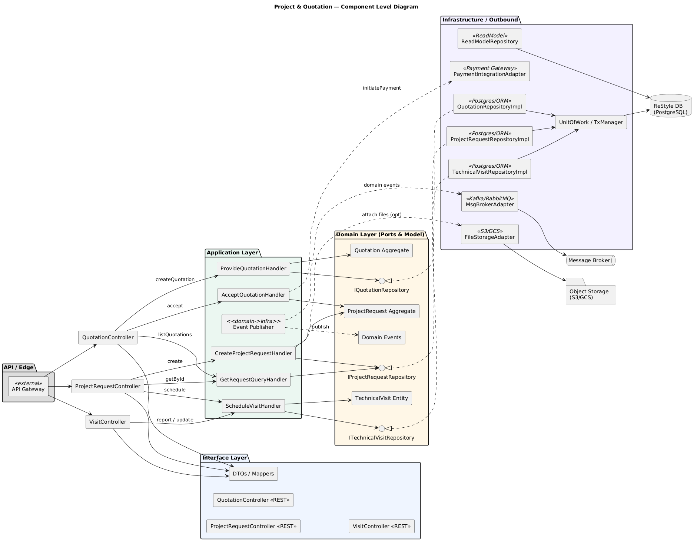
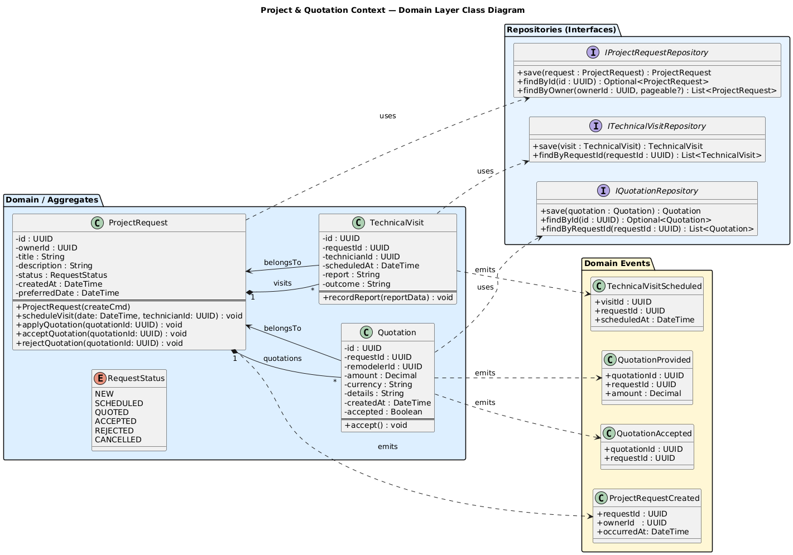
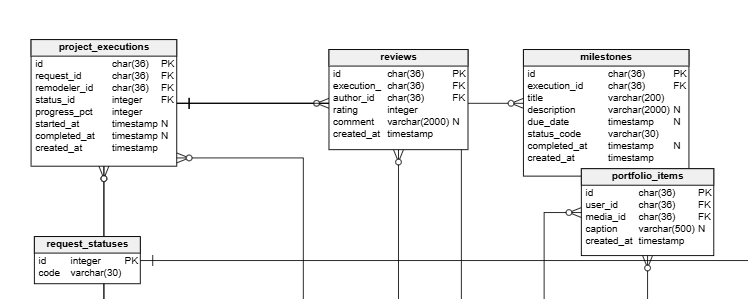
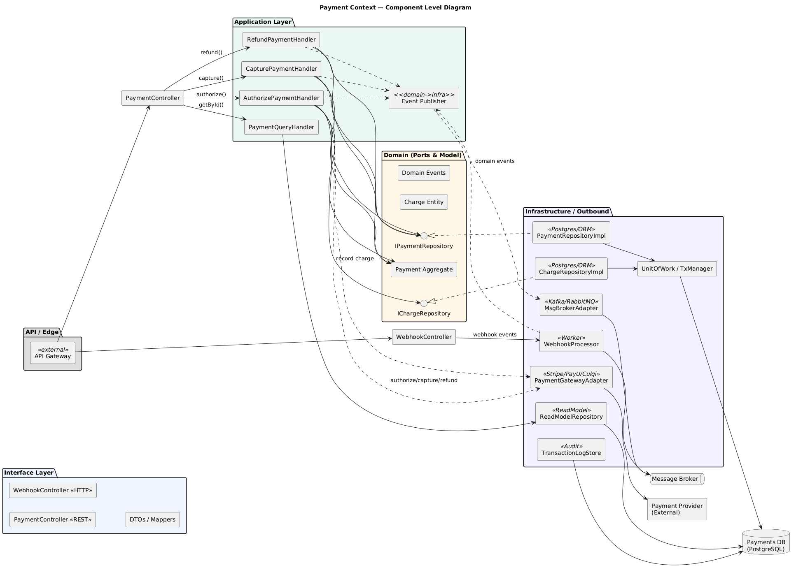
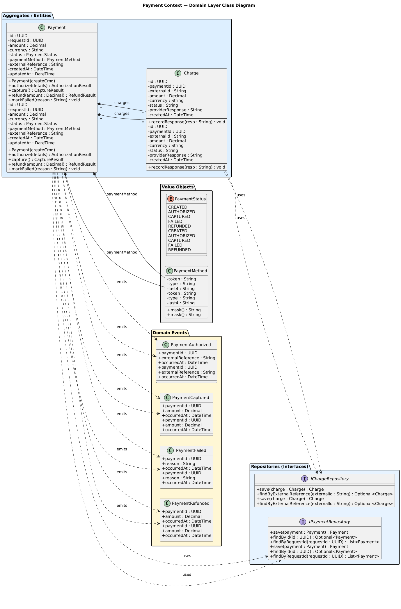
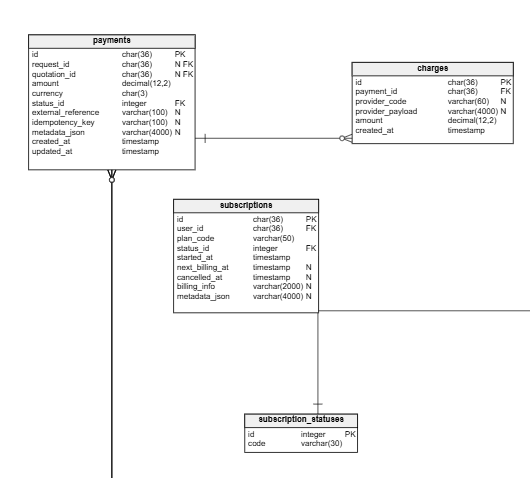
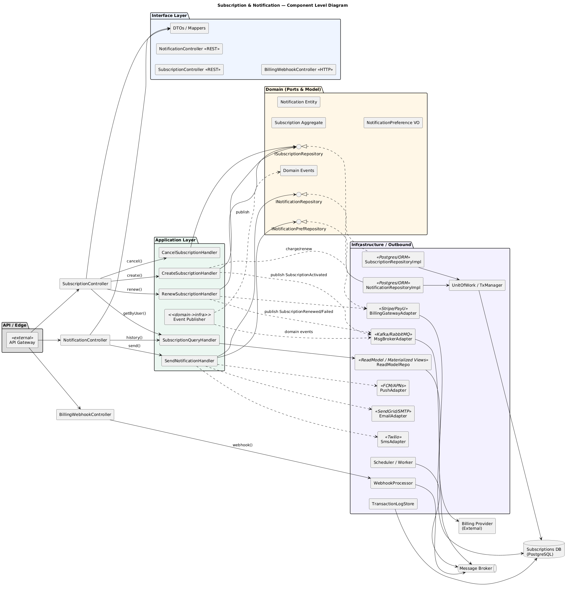
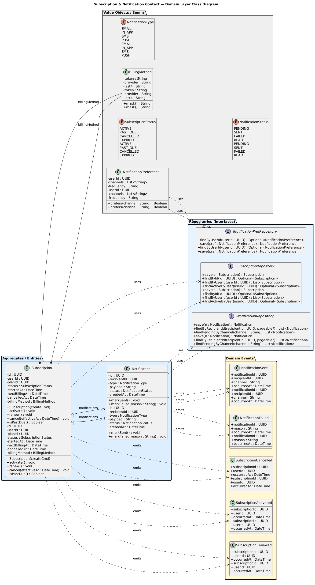
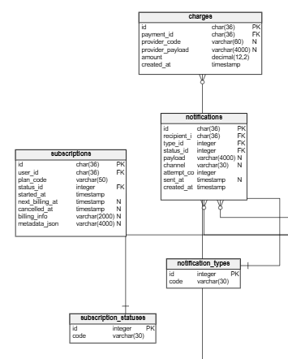

# Capítulo V: Tactical-Level Software Design

## 5.1. Bounded Context: User Management
### 5.1.1. Domain Layer

Aggregate | Name | Category | Purpose
---|---:|:---:|---
User | User | Entity / Aggregate Root | Representa la cuenta de un usuario (propietario o remodelador). Mantiene identidad, credenciales y estado.
Profile | Profile | Entity (part of UserAggregate) | Datos públicos y privados del perfil del usuario.

Attributes (User)
Attribute | Data Type | Visibility | Description
---|---:|---:|---
id | UUID | Private | Identificador único.
email | Email (VO) | Private | Correo normalizado/validado.
passwordHash | String | Private | Hash de la contraseña.
role | Role (enum) | Private | Rol: OWNER, REMODELER, ADMIN.
status | UserStatus (enum) | Private | Estado: PENDING, ACTIVE, SUSPENDED.
createdAt | DateTime | Private | Fecha de creación.
lastLogin | DateTime | Private / Nullable | Último acceso.

Methods (User)
Method | Return Type | Visibility | Description
---|---:|---:|---
User(createCmd) | Constructor | Public | Crea usuario válido (usa UserFactory).
changeEmail(newEmail: Email) | void | Public | Cambia y valida email; emite evento.
verifyPassword(plain: String) | Boolean | Public | Verifica contraseña.
changePassword(newHash: String) | void | Public | Actualiza hash.
activate() | void | Public | Activa cuenta (valida invariantes).
suspend(reason: String) | void | Public | Suspende cuenta.
updateProfile(profileData) | void | Public | Actualiza datos del Profile agregado.

Domain Events
- UserRegistered { userId, occurredAt }
- UserEmailChanged { userId, oldEmail, newEmail }
- UserActivated { userId }
- PasswordChanged { userId }

Domain Repositories (interfaces)
Interface | Purpose / Methods (firma)
---|---
IUserRepository | findById(id: UUID): Optional<User>  · findByEmail(email: Email): Optional<User> · save(user: User): User · deleteById(id: UUID): void
IProfileRepository | findByUserId(userId: UUID): Optional<Profile> · save(profile: Profile): Profile

Invariants / Rules
- Email único (enforced via IUserRepository).
- Passwords deben cumplir la política (PasswordPolicyService).
- Sólo el Aggregate Root (User) modifica su estado transaccionalmente.

---

### 5.1.2. Interface Layer

Controller | Name | Category | Purpose
---|---:|---:|---
UserController | UserController | Controller (REST) | Exponer endpoints CRUD y gestión básica de cuentas.
AuthController | AuthController | Controller (REST) | Manejo de autenticación, refresh y recuperación.
ProfileController | ProfileController | Controller (REST) | Gestión de perfil público/privado del usuario.

Methods (UserController / AuthController / ProfileController)
Controller | Method | Return Type | Visibility | Description
---|---|---:|---:|---
UserController | register(CreateUserRequest) | ResponseEntity<UserResource> | Public | Registra nuevo usuario. 201 Created.
UserController | getUserById(id) | ResponseEntity<UserResource> | Public | Recupera info de usuario. 200/404.
UserController | updateUser(id, UpdateUserRequest) | ResponseEntity<UserResource> | Public | Actualiza datos (no contraseñas).
AuthController | login(LoginRequest) | ResponseEntity<AuthTokenResource> | Public | Autentica y devuelve tokens.
AuthController | refreshToken(RefreshRequest) | ResponseEntity<AuthTokenResource> | Public | Renueva tokens.
AuthController | forgotPassword(ForgotPasswordRequest) | ResponseEntity<Void> | Public | Inicia flujo de recuperación.
ProfileController | getProfile(userId) | ResponseEntity<ProfileResource> | Public | Obtiene perfil público.
ProfileController | updateProfile(userId, UpdateProfileRequest) | ResponseEntity<ProfileResource> | Public | Actualiza avatar, bio, contacto.

Notes
- Usar DTOs / Request/Response Resources (no devolver entidades).
- Manejo de errores estandarizado (HTTP codes + problem/json).
- Validación de entrada y autorización en esta capa.

---

### 5.1.3. Application Layer

Service / Handler | Layer Role | Purpose
---|---:|---
UserCommandServiceImpl | Command Service | Orquesta casos de uso de escritura (registro, cambio de email, cambio de contraseña).
UserQueryServiceImpl | Query Service | Provee consultas optimizadas (getById, search).
AuthCommandServiceImpl | Command Service | Orquesta flujos de autenticación (login, refresh, forgot password).

Methods (signatures)
Component | Method | Return Type | Visibility | Description
---|---|---:|---:|---
UserCommandServiceImpl | handle(RegisterUserCommand cmd) | UUID / Optional<UserResource> | Public | Crea usuario, persiste y publica UserRegistered.
UserCommandServiceImpl | handle(ChangeEmailCommand cmd) | Optional<UserResource> | Public | Valida e invoca aggregate.
UserCommandServiceImpl | handle(ChangePasswordCommand cmd) | boolean | Public | Valida política y actualiza password.
UserQueryServiceImpl | handle(GetUserByIdQuery q) | Optional<UserDto> | Public | Devuelve vista/DTO desde ReadModel o repositorio.
UserQueryServiceImpl | handle(SearchUsersQuery q) | List<UserDto> | Public | Búsqueda paginada.
AuthCommandServiceImpl | handle(AuthenticateCommand cmd) | AuthTokenDto | Public | Valida credenciales, genera tokens.

Responsibilities
- Orquestar Domain (factories, aggregates), usar repositorios de dominio (interfaces).
- Emitir/encolar Domain Events (a Message Broker) cuando corresponda.
- No contener lógica de persistencia concreta ni detalles infra.

---

### 5.1.4. Infrastructure Layer

Repository / Adapter | Name | Category | Purpose
---|---:|---:|---
Notification: (example) | (not used here) | |
UserRepositoryImpl | UserRepositoryImpl | Repository (Postgres/ORM) | Implementación concreta de IUserRepository; maneja persistencia y transacciones.
ProfileRepositoryImpl | ProfileRepositoryImpl | Repository (Postgres/ORM) | Persistencia de Profile.
UserReadModelRepository | UserReadModelRepository | Read Model / Query DB | Consultas optimizadas (materialized views / read DB).
MsgBrokerAdapter | MessageBroker Adapter | Adapter | Publica/consume eventos (Kafka/RabbitMQ).
EmailAdapter | Email Service Adapter | Adapter | Envío de emails (SendGrid/SMTP).
AuthProviderAdapter | External Auth Adapter | Adapter | Integración OAuth/OIDC.
Cache | Redis Adapter | Cache | Cacheo de sesiones / datos frecuentes.
FileStorageAdapter | File Storage Adapter | Adapter | Almacenamiento de avatares (S3/GCS).

Repository Methods (UserRepositoryImpl)
Method | Return Type | Visibility | Description
---|---:|---:|---
save(user: User) | User | Public | Persiste o actualiza agregado.
findById(id: UUID) | Optional<User> | Public | Recupera usuario por id.
findByEmail(email: Email) | Optional<User> | Public | Buscar por email.
findAll() | List<User> | Public | Listado (paginado).
deleteById(id: UUID) | void | Public | Elimina por id.

Infrastructure Notes
- Implementaciones viven aquí y cumplen interfaces del dominio.
- Migraciones, constraints (PK, FK, unique email) y transacciones definidas en infra.
- Publicación de eventos y envío de correos se realizan mediante adapters.
- Leer/escribir optimizado mediante Read Model para consultas (CQRS).
- Secret management, monitoring y backups configurados en esta capa.

### 5.1.5. Bounded Context Software Architecture Component Level Diagrams
Diagrama de componentes — visión de alto nivel del contexto:

[Diagrama de componentes (PlantUML)](https://www.plantuml.com/plantuml/uml/ZLRDRkCs4BxhAGOfq2Q7H2qMxG96QcpYdy1e13jn5ZsqEOp5aSo68bMISjPe2_GX-eHzafAc4ojIQDH7pZVVp7ppaV8dOr7RfXBmEJiVgQfMagGrYNdYiaQD5UGlXqkx5GIQSeko5DI2c3KozSnb2GKAGucWme9Le7cvji2up-5A9fPRn_3Pa8OC9PPKELhuz-z_uBKotDA618mvbeuvIRw17_qFhXOpI672IeBJeY6Dm1piUdGMuacD-HEwuCa1U09VZNS_-2C1-CK7Rj3ICsuVuVAIlbZI4iLmcFnrA3EJxhJ0dE0MjwIxv9smgp2PJB-VJaC5FzX8IQkL4AHTZVl9yc4uVDnLR-mw5bjeLN11iV3uOMuWXGphchHvzEs-7URyVDWj_jY7X1wEGZgj15JIfGx8RbSTzWYgKo0EF2o-hWNFqVld_Prq064hLzEFq-_QMwagb6n9UiDpcbMrU7m9tJMajzs0doMICzbubowQbU1cJTfRYQaAkJmVSbbez7wAQ1Ph1GQWgUJ6aeOKcfgXfJX3lsDm12NPw-sCkNn3gFDrVny73xpVWb0bbovVKw79h265GkbIsVZEukE46VPvCOBZq-np3aOOUvLVF71QkpIh36oXKeo4whq3R-4BfQs1ho7pu3FdaEbq-d7omyuX_FLIptn3zrGhmwtIsxUnVKEjy8k5uAeiDPLegNsTOI8jjzjmXKCpE--46nmHBmZJPJsExdPz7DmV8xQ627SSswUEs2qoPTA_N1SNmwvwC80w0DhFTg7HMDtajj44ASmRkrADP5rNH87U4X-ctnwUylROeUVBouKojjHaqlbzDXosTlr_e84IsSw2XmGFVZqEoCoKrrezaRvYMDlmnlo4nHEczxXQSPlT1Tp4oI9Qc6Nsi4YN9DcDvYn0lFwknmrdRzZci_4edVjWW8qmNrFeX74JpgPSqD8gZIMrQtn8RqRB_KIIstdniz9FaCB3b_19rpjxCxIuGkCKlwVmls5y_QiytQkolBjrTn2DEqmA9HXfE9clVgFSmhwYmuPA0JTV9hytr3YwZ8nnSGW2xOBPTP9qV0gNVrvSlBl5fE_I08wiCadwBC6_yVaZLCUJOlu8QKweIEPhFEblB0IzUbrFXOYNhkEYS0e381aK9nys_ggrFxIDGS2GOsBNjbzo02nSPV899lAQ19rYSiJV55SqOlW1d1eEk6l_B5ID4dH53FcuGOiQcbeeP72gwjofWE8uMVU63k2PHAugIZKPicsQv1D9rbGY-Gy0)

### 5.1.6. Bounded Context Software Architecture Code Level Diagrams

#### 5.1.6.1. Bounded Context Domain Layer Class Diagrams

Diagrama de clases — modelo de dominio del contexto:

[Diagrama de Clases (PlantUML)](https://www.plantuml.com/plantuml/uml/ZLRDRkCs4BxhAGZtKBc5josAxi48ZFLQSbT0OWVsUdkUY6EPNOaKICg1smReG_G9-oHBIh8oiWKZEaJHVFC_tqpomLZGjYhom7mLiWGD1JC7uEfPo8pj8JT8a3G7O-RMQl5KMKnI9RVYBsG_1rRO7DdEe6OF82730gLb___x7ujK0KAoUpWvRE7jMIGWSzw2e8JqgzDbeo-GLyZMJtzYQis8VHVN3_ixO8mrGLditEHUqZuJTgoDfcnhjSkr0txqWE1WCHmxzADIEOAiuPU0EFJ99dpGuswNHDS6Z-x7izBy4vX3p-pW18Dve1RxKrZc86I7tynfu-J4zTqTogf03LOeEPjrylKVgtZJVMtYXtKKtnF9F7f8LiCLRotOohmXncEyYfBLxwy-5v-JBt7tkTrjlKPyxjCBcMOihR023Vk9pRDCOmOMNMdAkib6KHmlbqryabQlduApQJiU8iMQ0DE624HUqh5CUrCYMjftTbetc4XDquqfQGr1KurWaS-jKuZ0ucTHK6ENlBrNcP0K9kFtFiEqu3uiPi9Or5wqK4K1ae-9Pde0cM5TM2ZnEQQLZgy8TQxmDh5whZiJv_qJPIlr3gaLHxysL6WgKwBaeKOmIWxQLQLVjaUjzYB7i6pU4LWO3-nGW_R63Iuew9tEE-y4V19gI5mUbCGX03ZNQ0o5-dc6_2ApXd-ZNqRiXyd4lyz9zZZTdh7uYBA-KClbydtqsnMFpuD6xY0IkYOplIoDNALffVKrnGOMjoR3ma_phRvptYCIWIuvDXnntl3XHhWRH_9jcVRlnWPBPOHLsj-EC94MzHvID6F_5-7zyjVkReWpn1AVQ6TtweNR2ya_dX8UYdDCloBhqXywoE-yvUnAlLd2tgsvQMNWYA4lh3qYu_PDL3ZcQF4wawCId3IGLjKoy6PXpO4CQLFx1RPEhh9jDzIfjXhZrrzVf_8zss0EgNE5XecYLDg2j6W27vTD9hDBla_P20jXSKGrA6-7TIZJ1XNwZA8gmUNqx_vvzwxfFkaW1RioWmyekV-lvni0)

#### 5.1.6.2. Bounded Context Database Design Diagram

Propósito: gestionar cuentas, roles/estado y el perfil base del usuario.

Tablas “dueñas”

- users — identidad de cuenta, credenciales, rol y estado.

- profiles — datos de perfil (display_name, bio, phone, ciudad, lat/lng).

- Catálogos: roles, user_statuses.

---
## 5.2. Bounded Context: Discovery Context

### 5.2.1. Domain Layer

Aggregate | Name | Category | Purpose
---|---:|:---:|---
Search | Search | Entity / Aggregate Root | Representa una búsqueda y sus criterios; orquesta ejecución y resultados.
RemodelerProfile | RemodelerProfile | Entity | Perfil público de un remodelador usado en resultados de búsqueda.

Attributes (Search)
Attribute | Data Type | Visibility | Description
---|---:|---:|---
id | UUID | Private | Identificador único de la búsqueda (si se persiste).
criteria | SearchCriteria (VO) | Private | Criterios: location, expertise, rating, keywords, availability.
resultCount | Integer | Private | Número de resultados retornados.
createdAt | DateTime | Private | Fecha de creación.

Methods (Search)
Method | Return Type | Visibility | Description
---|---:|---:|---
Search(createCmd) | Constructor | Public | Crea instancia con criterios válidos.
applyFilter(filter: Filter) | void | Public | Aplica filtro a criterios y actualiza estado.
execute(): List<RemodelerProfile> | List<RemodelerProfile> | Public | Ejecuta la búsqueda orquestando repositorios / índices.

Value Objects
- SearchCriteria { location: LocationVO, expertise: List<String>, minRating: Float, keywords: String, radiusKm: Integer }
- LocationVO { lat: Float, lng: Float, city: String }

Domain Events
- RemodelersFound { searchId, resultCount, occurredAt }
- FilterApplied { searchId, filter, occurredAt }

Repository Interfaces (domain)
Interface | Purpose / Methods
---|---
ISearchRepository | save(search: Search): Search · findById(id: UUID): Optional<Search>
IRemodelerReadRepository | findByCriteria(criteria: SearchCriteria, pageable?): List<RemodelerProfile> · findByLocationAndExpertise(...): List<RemodelerProfile>

Invariants / Rules
- Debe incluir location o al menos una expertise.
- RadiusKm dentro de límites aceptables.
- Resultados deben paginarse y respetar privacidad del perfil.

---

### 5.2.2. Interface Layer

Controller | Name | Category | Purpose
---|---:|:---:|---
SearchController | SearchController | Controller (REST) / API | Exponer endpoints para ejecución de búsquedas y consultas de resultados.
FilterController | FilterController | Controller (REST) | Manejar aplicación de filtros a búsquedas existentes.

Endpoints / Methods
Controller | Method | HTTP | Request | Response | Description
---|---:|---:|---:|---:|---
SearchController | search(criteria) | POST /api/discovery/search | SearchRequest | SearchResultsResource | Ejecuta búsqueda con criterios; devuelve resultados paginados.
SearchController | getSearch(id) | GET /api/discovery/search/{id} | - | SearchResource | Recupera búsqueda guardada/estado.
SearchController | getProfiles(query) | GET /api/discovery/profiles | query params | List<RemodelerProfileResource> | Consulta directa de perfiles (filtros).
FilterController | applyFilter(searchId, filter) | POST /api/discovery/search/{id}/filters | FilterRequest | SearchResource | Aplica filtro a búsqueda y retorna vista actualizada.

Notes
- Usar DTOs/Resources (SearchRequest, SearchResultsResource, RemodelerProfileResource).
- Soporte para paginación, sorting y cache-control headers.
- Validación y rate limiting en API Gateway.

---

### 5.2.3. Application Layer

Service / Handler | Layer Role | Purpose
---|---:|---
SearchCommandHandler | Command Handler | Orquesta ejecución de búsquedas y publicación de eventos.
FilterCommandHandler | Command Handler | Aplica filtros sobre Search aggregate y actualiza estado.
SearchQueryHandler | Query Handler | Resuelve consultas de lectura usando ReadModel / SearchIndex.

Methods (signatures)
Component | Method | Return Type | Description
---|---:|---:|---
SearchCommandHandler | handle(ExecuteSearchCommand cmd) | SearchResultsDto | Valida criterios, consulta IRemodelerReadRepository / SearchIndex y retorna resultados.
FilterCommandHandler | handle(ApplyFilterCommand cmd) | SearchDto | Actualiza criterios en Search aggregate y publica FilterApplied event.
SearchQueryHandler | handle(GetProfilesQuery q) | List<RemodelerProfileDto> | Lee desde ReadModel / SearchIndex para respuestas rápidas.

Responsibilities
- Orquestar llamadas a repositorios de lectura y caches.
- Publicar eventos (RemodelersFound, FilterApplied) a través de broker.
- No contener lógica de persistencia concreta; usar interfaces de dominio.

Patterns / Considerations
- CQRS: separar commands (escritura/actualización) de queries (lectura).
- Uso de Search Index (Elasticsearch) y consultas geo para ubicación.
- Cache de resultados costosos en Redis.

---

### 5.2.4. Infrastructure Layer

Repository / Adapter | Name | Category | Purpose
---|---:|:---:|---
RemodelerReadRepositoryImpl | IRemodelerReadRepository | Adapter (Search Index) | Implementación usando Elasticsearch o Postgres+GIS para búsquedas por ubicación y expertise.
SearchIndexAdapter | SearchIndex Adapter | Adapter | Indexa perfiles y habilita consultas full-text y geo.
SearchCache | Redis Cache | Cache | Cacheo de resultados de búsquedas frecuentes.
SearchJobWorker | Background Worker | Worker | Indexación y reindex asíncrona de perfiles/portafolios.
ApiGateway / Edge | API Gateway | Edge | Enrutamiento, rate limiting, caching headers.

Infra Methods (ejemplos)
Method | Return Type | Description
---|---:|---
findByCriteria(criteria, pageable) | List<RemodelerProfile> | Ejecuta consulta en Elastic/Postgres+GIS con scoring.
indexProfile(profile) | void | Indexa o actualiza perfil en search index.
getCachedResults(key) | Optional<SearchResults> | Recupera resultados cacheados.

Infra Notes
- Indexar campos: name, skills, city, location (geo_point), rating, portfolioCount.
- Mantener pipelines que actualicen índices cuando RemodelerProfile cambia.
- Supervisar latencias de búsqueda y tasa de cache hits.
- Proteger endpoints con rate limiting y circuit breakers.

### 5.2.5. Bounded Context Software Architecture Component Level Diagrams
Diagrama de componentes — visión de alto nivel del contexto:

[Diagrama de Componentes (PlantUML)](https://www.plantuml.com/plantuml/uml/VLNhQkD65Fu_Jt58eHTAufRIBYp1h1DBMz4ryTefBHJ_E9QEvC6Z6NLcbCIqXJv4dx1FidDX5IKJ9H28vro-Y-URl3CMjUrR0SlhyslLTagIj8QP8vSTQcoX_7oujIT1eAcqA1j1enPpm4hTSzb0ZS8G4rHRi0eqRmuMAkvdk9BCSYi8bjoKwexq2QwLjFHWuVz__uC16pxG7GdNXOtRpLY7vH4RWhF5ke0PP5L3P_35Clp0NmpW3rzuZvRkyRI3oqktaRH4CP-pVqRZXSFIDPO47_14skt8ilp7F8yxjeIwF7X2MWb1sktPPDlR-NpdgpaNRdYgkhozCOxP2hkEjDazGLrqdU0bUlcFk8lyJVxzKzosHLdzx7u5wJ5aMeWJ7tjduFWuk_FUhVkzuEP0sXjHgHQvF9zpMMjyviOorE3hjTBMm9UmKXM9RnovFC_VP3y5Sdnmh8YW6-gKuLRfqzFgXbe_Jdf3M8sQ1hQmQ1fD3LeAN8V-jLOr5mIPjDoUefcHM93ppCl2wp1MzwNjDJd7RtgxLxsiFEqVyky-VvSJT8gs4zwMJBWbl3I1sMojZ7NSpBVlYwtpQA1So8eU5XLsDfePJo4SZ_kkiJoGRzXGnKsiUDnWw2EuxnYEOzVAD5TQ7KcFK7x1-eYp3UxttAu-nhvV9RStzMzA7vtasuSLIcn81sigjBX7uxo9P61v1RF8yGpGGB7ydVtPK-yQLcICTp52XkhgYjLALAJXB927e2MKDjcos3BsLOWRdCzXI0zx6hTpLql2iqkRqWpj_FfXhSSOPOMbEmUeD2_m5kY1ojxIz5oQ6ZVLa8rNa5o0_QVOnbAoOmqfEZhcfrXqgiP2lAvufQ4BKPi1XQlDKYa3JXgt1FdLvbHiR9qCQlfwN5pCdsVHwUnYmmiQGpO1uqsU4XUtfldogxd_xDnnrpMLC4o_dAtfzd58FKhf_m1DM1al8hA-vvhBXasv0vT_Nroy_ggmLwlHUnV55wKFnHUK9QDHY3-D4PtwvjAtvIt4VmV3zKjRt5R_9h1t9Ak-5Py0)

### 5.2.6. Bounded Context Software Architecture Code Level Diagrams

#### 5.2.6.1. Bounded Context Domain Layer Class Diagrams
Diagrama de clases — modelo de dominio del contexto:

[Diagrama de Clases (PlantUML)](https://www.plantuml.com/plantuml/uml/XLJDJjj04BxxAKRfeGwG5Aag1mieQHnBKP6eGk6-s1Ddozhhxeu3AKBgG_G9-oHTs-lDZx6QIzRppNxpCz_EbIQcgCm4XDFHL32jGyvInJ9FF_AyOEO4UiKI-SJp59PCQDn1ukh2X4ZnXv9m7ilyblz2EFK4BWb8WkBfYY3X2cFYClU8aq08kOxb6jK6fZ8dV2Ru-_iFX39ZF8Thja45TIhGvk8LB7vaASBWdeaIuURXXo7K0tWtgt_mua6J3DmYK_5ggZYXugm608v1o9XL6K00r_PuVsCnV2vG4TTOWLpJ-IqfK-sbXJEUBnWPWu4Z8HbP-oDkdgHAj34t5wnTiOIN-cjcxFESC4LbW5VFPRYDlysEqG6vw8IBEMrSg9hnTQSlivmuSTJm0IPfgZ1bX5L_md0sYw9EVspa4V34SDxTpKFx7RUD2muwQN65kXGqbMLEs_hSNMI4oQH2GdFwpZEieOiBMqD3wJUEqomPMZih2h69k21K_hB-6ngEjUI96n769Q5Vc6BPWy1XEwe5PZ91WUgRakOcNkxt-X3khJjd6RhkMflHkH2w8ugc3rr5Z3eZgcpzmdDT8HcIz4r9dNIDlJDf-qncQyph5n15qLdu2LwwDUl8Z2bn8jDry-TxXH_t3zHWCevBfReJVNMncfbDpFWu_YzICzZz_lJ4w1Izm49gJb9L4lUhBDMInQY7rGeuYpvQYVCMW7aZDNTliqsEhT5lCdGY7xgJopLFlcpcYUzqKhdS5DNuc3XlV1kjxKLrlLyWIxh1BM_xflpUrtO2hT8_zqjzZxCLroHFPkq-yzyKtqdlmZjvOtVrXs-7zDueJjJSUiMBQWF5CgihDoRpLMfJYlRiuZaQZGvtTE2sJkiaZTFWT3m-6dHVS60bgxqEPBXtjslW7f_N4e_7bvtt4G1cdFIEoxwidSEkHrTVWIaKTrdwrH30pn8LHqDvXNbIPk8V)

#### 5.2.6.2. Bounded Context Database Design Diagram

Propósito: ofrecer una vista pública indexable para matching y búsquedas.

Tablas “dueñas”
- public_profiles — read model público (título, rating, ciudad, lat/lng).
- public_profile_skills — habilidades visibles para búsqueda.
- skills — catálogo de skills.

---

## 5.3. Bounded Context: Project & Quotation Context

### 5.3.1. Domain Layer

Aggregate | Name | Category | Purpose
---|---:|:---:|---
ProjectRequest | ProjectRequest | Entity / Aggregate Root | Representa la solicitud de proyecto iniciada por un propietario; orquesta estado del ciclo solicitud→visita→cotización.
Quotation | Quotation | Entity | Representa una cotización/propuesta económica asociada a una solicitud.
TechnicalVisit | TechnicalVisit | Entity | Registro de visita técnica programada y resultado técnico (mediciones, observaciones).

Attributes (ProjectRequest)
Attribute | Data Type | Visibility | Description
---|---:|---:|---
id | UUID | Private | Identificador único de la solicitud.
ownerId | UUID | Private | Identificador del propietario solicitante.
title | String | Private | Título o resumen de la solicitud.
description | String | Private | Descripción detallada del requerimiento.
status | RequestStatus (enum) | Private | Estado: NEW, SCHEDULED, QUOTED, ACCEPTED, REJECTED, CANCELLED.
createdAt | DateTime | Private | Fecha de creación.
preferredDate | DateTime | Private / Nullable | Fecha preferida para visita técnica.

Methods (ProjectRequest)
Method | Return Type | Visibility | Description
---|---:|---:|---
ProjectRequest(createCmd) | Constructor | Public | Valida y crea solicitud inicial.
scheduleVisit(date, technicianId) | void | Public | Programa visita técnica; cambia estado a SCHEDULED.
applyQuotation(quotationId) | void | Public | Asocia cotización y cambia estado a QUOTED.
acceptQuotation(quotationId) | void | Public | Marca solicitud como ACCEPTED.
rejectQuotation(quotationId) | void | Public | Marca solicitud como REJECTED.

Domain Events
- ProjectRequestCreated { requestId, ownerId, occurredAt }
- TechnicalVisitScheduled { visitId, requestId, scheduledAt }
- QuotationProvided { quotationId, requestId, amount }
- QuotationAccepted { quotationId, requestId }

Repository Interfaces (domain)
Interface | Purpose / Methods
---|---
IProjectRequestRepository | save(request: ProjectRequest): ProjectRequest · findById(id: UUID): Optional<ProjectRequest> · findByOwner(ownerId: UUID, pageable?): List<ProjectRequest>
IQuotationRepository | save(quotation: Quotation): Quotation · findById(id: UUID): Optional<Quotation> · findByRequestId(requestId: UUID): List<Quotation>
ITechnicalVisitRepository | save(visit: TechnicalVisit): TechnicalVisit · findByRequestId(requestId: UUID): List<TechnicalVisit>

Invariants / Rules
- Una solicitud puede tener 0..* cotizaciones; solo una puede ser aceptada.
- Solo solicitudes en estado NEW o SCHEDULED pueden recibir cotizaciones.
- Las operaciones que cambian estado deben validar transiciones permitidas.

---

### 5.3.2. Interface Layer

Controller | Name | Category | Purpose
---|---:|:---:|---
ProjectRequestController | ProjectRequestController | Controller (REST) | Gestiona CRUD de solicitudes y acciones (agendar visita, aceptar cotización).
QuotationController | QuotationController | Controller (REST) | Crear y consultar cotizaciones asociadas a solicitudes.
VisitController | VisitController | Controller (REST) | Programación y registro de visitas técnicas.

Endpoints / Methods (resumen)
Controller | Method (HTTP) | Request | Response | Description
---|---:|---:|---:|---
ProjectRequestController | POST /api/requests | CreateRequestDto | 201 Created + RequestResource | Crear nueva solicitud.
ProjectRequestController | GET /api/requests/{id} | - | 200 + RequestResource | Obtener detalle de solicitud.
ProjectRequestController | POST /api/requests/{id}/schedule | ScheduleVisitDto | 200 + VisitResource | Agendar visita técnica.
QuotationController | POST /api/requests/{id}/quotations | CreateQuotationDto | 201 + QuotationResource | Proveer cotización para solicitud.
QuotationController | GET /api/requests/{id}/quotations | - | 200 + List<QuotationResource> | Listar cotizaciones de una solicitud.
QuotationController | POST /api/quotations/{id}/accept | - | 200 + QuotationResource | Aceptar cotización (inicia flujo de pago).
VisitController | PUT /api/visits/{id}/report | VisitReportDto | 200 + VisitResource | Registrar resultado de visita técnica.

Notes
- Usar DTOs/Resources; no exponer entidades de dominio.
- Validaciones y autorización en esta capa (roles: OWNER, REMODELER, TECH).
- Respuestas estandarizadas con códigos HTTP apropiados.

---

### 5.3.3. Application Layer

Service / Handler | Layer Role | Purpose
---|---:|---
CreateProjectRequestHandler | Command Handler | Orquesta creación de solicitudes, persistencia y publicación de ProjectRequestCreated.
ScheduleVisitHandler | Command Handler | Programa visitas, crea TechnicalVisit y publica TechnicalVisitScheduled.
ProvideQuotationHandler | Command Handler | Crea cotización asociada; valida estado de solicitud y publica QuotationProvided.
AcceptQuotationHandler | Command Handler | Marca cotización como aceptada, actualiza solicitud y publica QuotationAccepted; inicia flujo de pago (evento).
GetRequestQueryHandler | Query Handler | Recupera vistas/DTOs optimizadas para lectura.

Methods (firmas)
Component | Method | Return Type | Description
---|---:|---:|---
CreateProjectRequestHandler | handle(CreateProjectRequestCommand cmd) | UUID | Crea solicitud y retorna id.
ScheduleVisitHandler | handle(ScheduleVisitCommand cmd) | UUID | Programa visita y retorna visitId.
ProvideQuotationHandler | handle(ProvideQuotationCommand cmd) | UUID | Persiste cotización y retorna id.
AcceptQuotationHandler | handle(AcceptQuotationCommand cmd) | boolean | Valida y acepta cotización; retorna success.
GetRequestQueryHandler | handle(GetRequestByIdQuery q) | Optional<ProjectRequestDto> | Devuelve DTO desde ReadModel.

Responsibilities
- Orquestar agregados y factories, validar reglas de negocio, emitir Domain Events.
- Coordinar con infra (repositorios, message broker, external services).
- Mantener separación Commands vs Queries (posible CQRS).

---

### 5.3.4. Infrastructure Layer

Repository / Adapter | Name | Category | Purpose
---|---:|:---:|---
ProjectRequestRepositoryImpl | ProjectRequestRepositoryImpl | Repository (Postgres/ORM) | Implementación de IProjectRequestRepository; maneja transacciones.
QuotationRepositoryImpl | QuotationRepositoryImpl | Repository (Postgres/ORM) | Persistencia de cotizaciones.
TechnicalVisitRepositoryImpl | TechnicalVisitRepositoryImpl | Repository (Postgres/ORM) | Persistencia de visitas técnicas.
PaymentIntegrationAdapter | Payment Adapter | Adapter | Integración con pasarela de pago (inicio de cobros tras aceptación).
MsgBrokerAdapter | Message Broker Adapter | Adapter | Publica eventos domain (QuotationAccepted, ProjectRequestCreated).
ReadModelRepository | ReadModel / Materialized Views | Adapter | Vistas optimizadas para consultas (requests + latest quotation).
FileStorageAdapter | File Storage | Adapter | Almacena fotos/reportes de visita (S3/GCS).

Infra Methods (ejemplos)
Method | Return Type | Description
---|---:|---
save(request: ProjectRequest) | ProjectRequest | Persiste o actualiza solicitud.
findByRequestId(requestId: UUID) | List<Quotation> | Recupera cotizaciones.
initiatePayment(requestId, amount) | PaymentResponse | Invoca pasarela de pagos cuando se acepta cotización.
indexRequestView(requestId) | void | Actualiza read model / búsqueda.

Infra Notes
- Definir constraints en BD: FK entre requests y quotations; unique constraints según negocio.
- Garantizar atomicidad en aceptación de cotización y creación de pago (sagas/transactions).
- Publicar eventos para orquestación entre bounded contexts (p. ej. Payment Context).
- Registrar auditoría y trazabilidad (audit logs) para solicitudes y cotizaciones.

### 5.3.5. Bounded Context Software Architecture Component Level Diagrams
Diagrama de componentes — visión de alto nivel del contexto:

[Diagrama de Componentes (PlantUML)](https://www.plantuml.com/plantuml/uml/ZLRTRkj44BxVfnWL2TgBDg0ZE59LejEVk4GqIfeKk81UJEoniyJPDRlhdXC14W_14_8aZBq-SP9wZqykz_jcvfkV6UUTTMXSkSc5NKjLeC4Dn7fJQ4NABTms9p0KErHPJdiKky94lvSgWnHpIoAdr87JO6IsSf38oaPg9Pnqx65czE_y05_2OwaTLWZyzy-_SFin43pG2-Lm9p5Zxq9y1TzNFxYUZM40eoGZE4rBCWW9qsvkppmk2epNoE19Ipo1B-xg7_mf07wjW7jqz1wtpt1rHHyS6ONvS2Z-RiEC5R-c61Cyu9RCiVCZc2ECHj6tKUGZDCdDwO-IhBlLoXcTvsGusdoqU1eEdolMBl4GuMTfPT3wxcbgERy95WKP-rnfFypi_7mOLlBSGMu5zV0ETJ57XEDuYsEnRQXUge_MIsldeoXo6TU-krjtHF3DkuxUHj_uvjqQGaU72Vs0AgapPNmHhoWfSwfrxGDiyY8JsgMsZrt7CHMk4xgd9Wh3PBRxqEY5b8DPkSobNP6ffZNH6vJgV2XLQj2FR5_nFvKGN49SmxrU0ZBPGKRkPZjEUZm42iVsjdaFJqMejgt-5WbuwSc12znsnuPz13l9Fh160WCRpDvGeOs30PH5WexQGRwhEztCy6d1Wfssi8MDJYZNhyxT8Nt6FYqVrqb5FkC9ZwBexUYxUiBbxdQD3pisPoaiJflj8MkNR8ZmHF5AoHZpEhazrkjZ2DTPPYX3HuStyEZzq2ECb9DkMoDDdlLg-BCN7F2s-64DWRwmLL14U1ZPAf1IO6nwvVKd5svYZz2kjdwg7E4k1_QgJvvuVTykBeR77OPBA3nX_-ES6hJEbB4h3S40fgLRwb8bnqiH95ORyIRwklrWTsiSRugykhepRLrco0wcyybmU32udqCELIviCITCwjrjoHLnz-nPCznkIBcnSfIPMirrWeNpNue6_FZjzXOJczqOlIQpH_mHqpKEvhXSIZTvzBn8vhJWg9ZH7dFnPd1_k_2CdvHqq_GNRTOmWASF4rJCDVL29kXmYPRhFoV_V_7kvZTrscIvU7pWWuIM7qMgyuGCd4oNLVcXYSXS7ydpfWl1RIdPtOIiPHny2ZKukH4YE69mzTV5HKztHTSUUCDWaqLe5xnXJyE5w9atNfjmVOEYUip2adfj0u2tuYvsJsi3YevPyY3tjMCU6U6c1cv31_yI4dylgBuNuKlBzi6DyOuafodHKKCAtzxMNrTkbu3EORo2b44BfxfmP-8TgQJSvFy3)

### 5.3.6. Bounded Context Software Architecture Code Level Diagrams

#### 5.3.6.1. Bounded Context Domain Layer Class Diagrams
Diagrama de clases — modelo de dominio del contexto:

[Diagrama de Clases (PlantUML)](https://www.plantuml.com/plantuml/uml/bLRTRjis5BxNKnnum2OtTRTXM2-4DQihoPY7e6dZPBjco6EPgqIg9ENEAmpi8VQ4Uv9H4Ys7jBKcLnRF3x_pdU_mmA-r8SeqLHdf3rpKH94Az8Om-OcB0jQarFZ0GqkYzTmOnUyRWqignOh_XV1TLEBQW96WUB4nmBX2QhWKaU6cH7Ydv1_M05_3-qOQqdeWbSBWdmR-_ViVo6H5k80hiaC5QOi16IU5HOoYcj0Ff42OkA1lOLuK2WjYK4_WgopByyK2FaS0A9eARl1ZWzgiB4gZEpF0s_ptxdUL_f9dTrTvrftUtrtVkizvckRl3eUR_DSyFHpI-Tiql-fJzb44VGSEX1oOWva1Pv30tTqoSsVvIQ1Q1iQ-9GciZB8jTaQ6cYfUjvq9NRgdalZKd9Cg90RPt5X_PhzkUONELIjSerB8MdleVlMg-xa8cCJzVMd5fiwlwGPPK-9lN7CJC-iytlGS3DADu9GJiMGzoQb5sahEN3gfwt8tY1v_T5-ZuPHYRHuVhz0M_wXuJxuXOLGvrVTZUMAk9CFoL5HIoKPq8Y3b5IaFyZHAeQ2xKxaDuQKEpUDgkivW2_j6oXA9y7Hq_lWytzjU9b9sAZwHj2Uoxt73SRvYXRLK9gGe6qDbXOFPPw6GIiLkkiouly3UIZnM-zETa6zHc7ORB1QBbzcFy7daeQPzVrq3BiuJlXYUBGHcsibfoNfSzoDjNXsQCy1jhJa46wbXlBNxqocs9BUSFG0Qdi4ZmSBfFGypFupWqs52tLg5DJTISTGGBuL1jIOKzTHgcBzS_E0sEZyuOEaBEUJlXc8qsMBiW249X9-UM5pMcWlsPhTayV0Msj3hRX6JyYS_vz9Bkcwd9FPN_7EeBJzoN-BFxJrNN9ipT-nzQaE3nrWDVRPN3i7JXuV7iHd2VIAkCfiMwZPmy3A3ylsf7-FGpRwzpe-UdbYUMfcVVNcOj6-E_n90OTdLhZUyrX1JMNKbMaltvyFNftty-ZZP6eXW_SFLqoW8dNm_WMUp6KoUJOvIGF8W-_yoWgMSE9JeUDDiTXbMby0zbb8K-bP6mGLVYBOjSTiIksq9M76jBKnOuuiNboDhCsbpZ0w1RSB8wdCf7YaR7MwkyRXmzGnnbestGnfD2Zp7P7nn93O90qJlCOQHfxH7Xt_8YLwZO4rL_WS0)

#### 5.3.6.2. Bounded Context Database Design Diagram
Propósito: orquestar el ciclo de vida del proyecto y su estado operativo.

Tablas “dueñas”

- project_requests — solicitud del propietario (estado y datos).

- technical_visits — visitas técnicas planificadas.

- quotations — cotizaciones de remodeladores (estado de cotización).

- project_executions — contrato en ejecución (status, progress).

- milestones — hitos de ejecución.

- reviews — feedback del cliente al cerrar.

- issues — incidencias durante la ejecución.

- Catálogos: request_statuses, quotation_statuses, execution_statuses.

---

## 5.4. Bounded Context: Payment Context

### 5.4.1. Domain Layer

Aggregate | Name | Category | Purpose
---|---:|:---:|---
Payment | Payment | Entity / Aggregate Root | Representa el flujo de pago asociado a una cotización/servicio: autorización, captura y liquidación.
PaymentMethod | PaymentMethod | Value Object / Entity | Datos del método de pago tokenizado (tarjeta, wallet).
Charge | Charge | Entity | Registro de transacción (amount, currency, status, externalId).

Attributes (Payment)
Attribute | Data Type | Visibility | Description
---|---:|:---:|---
id | UUID | Private | Identificador único del pago.
requestId | UUID | Private | Referencia al ProjectRequest o Quotation asociado.
amount | Decimal | Private | Monto a cobrar.
currency | String | Private | Moneda (ej. PEN, USD).
status | PaymentStatus (enum) | Private | Estado: AUTHORIZED, CAPTURED, FAILED, REFUNDED.
paymentMethod | PaymentMethod (VO) | Private | Método de pago tokenizado.
externalReference | String | Private / Nullable | Id del proveedor de pagos.
createdAt | DateTime | Private | Fecha de creación.
updatedAt | DateTime | Private | Última actualización.

Methods (Payment)
Method | Return Type | Visibility | Description
---|---:|---:|---
Payment(createCmd) | Constructor | Public | Crea y valida un pago inicial.
authorize(paymentDetails) | AuthorizationResult | Public | Intenta autorizar fondos (invoca gateway via domain service).
capture() | CaptureResult | Public | Captura fondos previamente autorizados.
refund(amount) | RefundResult | Public | Inicia reembolso parcial/total.
markFailed(reason) | void | Public | Marca pago como FALLIDO y emite evento.

Domain Events
- PaymentAuthorized { paymentId, externalReference, occurredAt }
- PaymentCaptured { paymentId, amount, occurredAt }
- PaymentFailed { paymentId, reason, occurredAt }
- PaymentRefunded { paymentId, amount, occurredAt }

Repository Interfaces (domain)
Interface | Purpose / Methods
---|---
IPaymentRepository | save(payment: Payment): Payment · findById(id: UUID): Optional<Payment> · findByRequestId(requestId: UUID): List<Payment>
IChargeRepository | save(charge: Charge): Charge · findByExternalReference(externalId: String): Optional<Charge>

Invariants / Rules
- Un payment pasa por transiciones válidas: CREATED -> AUTHORIZED -> CAPTURED -> REFUNDED.
- Sólo se captura si existe autorización válida.
- Montos y moneda deben coincidir con la cotización asociada.
- ExternalReference único por transacción con proveedor.

---

### 5.4.2. Interface Layer

Controller | Name | Category | Purpose
---|---:|:---:|---
PaymentController | PaymentController | Controller (REST) | Exponer endpoints para iniciar autorización, captura, consulta y reembolso.
WebhookController | WebhookController | Controller (HTTP) | Recibir callbacks/webhooks del proveedor de pagos.

Endpoints / Methods (resumen)
Controller | Method (HTTP) | Request | Response | Description
---|---:|---:|---:|---
PaymentController | POST /api/payments/authorize | AuthorizePaymentRequest | 201 Created + PaymentResource | Inicia autorización de fondos.
PaymentController | POST /api/payments/{id}/capture | CaptureRequest | 200 OK + PaymentResource | Captura fondos autorizados.
PaymentController | GET /api/payments/{id} | - | 200 OK + PaymentResource | Consulta estado del pago.
PaymentController | POST /api/payments/{id}/refund | RefundRequest | 200 OK + PaymentResource | Solicita reembolso.
WebhookController | POST /api/payments/webhook | ProviderWebhook | 200 OK | Recibe notificaciones de proveedor; valida firma.

Notes
- WebhookController debe validar firma/hmac y procesar asynchronously.
- No exponer datos sensibles del método de pago; manejar tokens.
- Respuestas con códigos HTTP adecuados y Resource/DTO.

---

### 5.4.3. Application Layer

Service / Handler | Layer Role | Purpose
---|---:|---
AuthorizePaymentHandler | Command Handler | Orquesta autorización: valida request, crea Payment aggregate, invoca PaymentGatewayService.
CapturePaymentHandler | Command Handler | Ejecuta captura sobre pago autorizado y actualiza estado.
RefundPaymentHandler | Command Handler | Maneja reembolsos parciales/ totales.
PaymentQueryHandler | Query Handler | Devuelve estado y transacciones asociadas.

Methods (firmas)
Component | Method | Return Type | Description
---|---:|---:|---
AuthorizePaymentHandler | handle(AuthorizePaymentCommand cmd) | PaymentDto | Crea Payment, solicita autorización al gateway, persiste y publica PaymentAuthorized.
CapturePaymentHandler | handle(CapturePaymentCommand cmd) | PaymentDto | Solicita captura al gateway, actualiza Payment y publica PaymentCaptured.
RefundPaymentHandler | handle(RefundPaymentCommand cmd) | PaymentDto | Solicita reembolso y publica PaymentRefunded.
PaymentQueryHandler | handle(GetPaymentByIdQuery q) | Optional<PaymentDto> | Retorna vista/DTO para UI/consumers.

Responsibilities
- Orquestar interacciones entre Payment aggregate y domain services (PaymentGatewayService).
- Publicar Domain Events a broker para coordinar con otros contexts (p. ej. Project lifecycle).
- Manejar errores y políticas de reintento en casos transaccionales (usar sagas cuando aplica).

Sagas / Long-running flows
- Aceptación de cotización -> crear Payment -> autorizar -> al confirmarse captura -> notificar a Project Context -> emitir factura.

---

### 5.4.4. Infrastructure Layer

Repository / Adapter | Name | Category | Purpose
---|---:|---:|---
PaymentRepositoryImpl | PaymentRepositoryImpl | Repository (Relational DB / ORM) | Implementación de IPaymentRepository; persiste pagos y estados.
ChargeRepositoryImpl | ChargeRepositoryImpl | Repository | Persistencia de charges/transactions externas.
PaymentGatewayAdapter | External Payment Gateway Adapter | Adapter | Implementación concreta contra proveedor (Stripe, PayU, Culqi). Maneja authorize/capture/refund APIs.
WebhookProcessor | WebhookProcessor | Adapter / Worker | Valida y procesa callbacks, publica eventos internos.
TransactionLogStore | Audit/Log Store | Adapter | Registro de transacciones y respuestas del proveedor.
DbMigrations | Migrations | Tooling | Gestiona esquema (payments, charges, indexes).

Infra Methods (ejemplos)
Method | Return Type | Description
---|---:|---
authorize(payment: Payment): AuthorizationResult | Invoca API del proveedor para reservar fondos.
capture(externalRef, amount): CaptureResult | Ejecuta captura en proveedor.
refund(externalRef, amount): RefundResult | Ejecuta reembolso.
save(payment: Payment): Payment | Persiste estado actualizado del aggregate.

Infra Notes
- Tabla payments: id PK, request_id FK, amount, currency, status, payment_method_token, external_reference (unique), created_at, updated_at.
- Tabla charges: id PK, payment_id FK, provider_response, provider_code, amount, created_at.
- Manejar idempotencia en endpoints (use idempotency keys al llamar gateway).
- Webhooks deben validar firma y procesar en colas para resiliencia.
- Considerar cifrado/seguridad para tokens y cumplimiento PCI (no almacenar PAN).
- Implementar reconciliación periódica entre registros locales y proveedor.

### 5.4.5. Bounded Context Software Architecture Component Level Diagrams
Diagrama de componentes — visión de alto nivel del contexto:

[Diagrama de Componentes (PlantUML)](https://www.plantuml.com/plantuml/uml/ZLNRZXf747tlhoWvKc8_x98eIYnPAsIMIuoo21Pm_93mqCmKGukXUzpTisjoaV8H-S9yIQelZC4qe_22rETKrUapLLrlZUNQrliIPlomHsbl-cfVAOdI6cPsGbPSypranyE5FPG86ZFBPL7Y2SLiUQwUXInWmqk3hCID1Qj0Ys9h8HSkHYZ9hB0b7gj1NqcBdopy-_S_q5I61tp24WQ25vIPiOfdEruWlEZDnj21OLxW2_Xgu7_m1mFurG4_SOlF_B22kplAY5hoijjbVvs4ZoKTRtY6yC0Fg2d7S3ZwOJGAEQ8afqYhiaHDYUR3nRBRNJdu0wwtIktEu7VBvIp2W-NKaBO9hohKPdLMjrTLfSYuk_xdohtHwz5tKNrjjqgBtp5AUCTbJWLytZwlRArJo1mtjSmJG3nwh54VJi-7JyxRMRqkXTcYTaRbQi-5lEaAkT7y2xS67eENCwMjWQzXed8iNv7qqMZqUlYZbouQHyUnwXmhPOHL-d0EzxTS5tYADaAXLnGQ2sxHomnC64ehxC6VH2LU_nVMZfrmOtMTEPUW0zFQhXNvudH-F_hs-74lr8ttLUaSc2bZgRhfJESJCg2f_t-OS-IvT-KpsH6Ruy2AfMDxzd9UsM3-mcfHOOVmzvr-NNuKWHyRRQPLXiOeJ_sWz0vrm9UQIyFzC3seOa5LqL5wTIviO4nCSQyL1PmK-vblThmpv-kri9F7m7ilXPrkN6uoRlbfmYLvght1ERTypGqv7EKR6Dp_9bz64nQF3zG9t1soZpNMn9kGM0g7KDc3atlMl1HD8g2BFOaSDMKRnZaDkMRpwI_ZmN3Es3T-nk6c2yt8ilCPlo7iSc9Nbwp4uAweG9FOLpaPK9R8wl9Sdr9u0_m8lNnrFJuzoHIT1Q0bDZth5AhzULjawZ6Wm0Bj_M7i8XF-kCX47rBOSpW3zAD8FfvQvvoCeze1FnBq7rlGiBH_iLhoBKWwri9FkTH2Jrj3xFHWi_OR91x0bWkawMdzQNQxciltrZTBfdGEcKTQuczlk-bNwxpNEx5lEw494xTjJnS7CMobAcmb8GjskQSeG-fHUmDXVHsxiVr65scJWblOwQ-J9YU69qqa0_mAWsUXtUKlFpJS_NbxUss1iVYTB-Z99SPOEati-clh89siFUOA4A9eQQH6h05Pkbq2tco9XCU4kwMJw9M899TdK_OjohpUb_y1)

### 5.4.6. Bounded Context Software Architecture Code Level Diagrams

#### 5.4.6.1. Bounded Context Domain Layer Class Diagrams
Diagrama de clases — modelo de dominio del contexto:

[Diagrama de Clases (PlantUML)](https://www.plantuml.com/plantuml/uml/xLRlRXf74Fz-Jp6YKdl4mawQDgrGPOLoa22vjOLDFbHyyFXsW2rtkzVTELfIMUf3z0dx9Bs5NSoTSIAh_OWbm-pCRtV-3_FMCXekyoooIwaAD9Y3NQ3GlqirXnbcblOaQORMzfYDl2kPHgbMr_8ZmSieena3Qp1olc0Gqb3AKgk89MS4LxZEIJ7qjMBwW-6Vl_w6HESe5LpWcWpqtRkGI9nNMgAem7I9SuBM1ynAWikxNobbsu8l1fi_-3E2hIdXvP-85rfi-00TOBqa1LsuPbDv4PZhWg39h1xXR-hC4yZHBkFsFlS-gZv8bNbGUCt8fVKA--D1xsQGREZUvERzvNZqYp_sUrStax4_37kZ2q-E1yF9pqbrS6_VxtdScyyDpP79mXaC54kMv3nFai5WE7pi-SvdAQ0BayaeyMT3lvLaUTHWOwvBnHKleLJcc7bsMXf3AbqtusEtVdRhVdjXKGk-nuIpnrJf9gCm6zECd0PgQaWD8PFeRMogg1kPanULXNX2rF6PyXhZxIFzNBIz0ClA1YC_KYo8KMRMfRFdcUXASqospDZ3KoouD1GxL7zBr-I6PgKISJDu3ZxUY6he7CroM2ab4Hj2gnzAqLrOQIbyIVbKzXTevlHa9dsOcvaCaNLy__n_ot6TMnYzae9CvLcXbNr6tZgxeANQY70_DXLnE11LA48rjrwru4Md0wqNhH2MBgGRmWQG0pGQlrklnRr-ycDci2ArcI33uV1DyktZFWgrGM6Ad1oE-yadAje3TEeY_JWqzqsTlj8-gx6Pp-VgSRNuUIsDKdskacqV_F_ErARZc0fj9MiZoK8yKancXYdPjljjU3DyxIUa308O1Ul2nVNEFeihYhsH3yEh_K1wt4mgyUDw9E9TNphCPU6626O_UF1v3JqEmpSsdjg_Uo4jxz-xZ-esRml_APFJq1PRM7j7rImODAiqFZ0lQevi7paFCVyAQDCpy2MO1qjAY_kTU7fwVg21ka2vv3ggNlAVnFXoFOoerrh0r407Sjw5qfAD_4Hng0DH3gZeBIdXDgBRszkpiogU6HN8YowatUd4ah5JN656qqj5YP4hWWvCLFLjh1Geu8fCYGf14FGbgLIYdIOwBPr9TlfEylloRdezUldTrzztglzNdNUcBFJhgOkouQdGgPrMEIwOJEV3QIwYuufsND7WkA8TLxJ0FQvennNjkA8TLxJZYlOl)

#### 5.4.6.2. Bounded Context Database Design Diagram

Propósito: gestionar cobros, conciliación y suscripciones.

Tablas “dueñas”

- payments — orden de pago (estado, referencia externa, idempotency).

- charges — cargos/intent de procesador.

- subscriptions — suscripción a planes (freemium/premium).

- Catálogos: payment_statuses, subscription_statuses.

---
##  5.5. Bounded Context: Execution & Feedback Context

#### 5.5.1. Domain Layer

Aggregate | Name | Category | Purpose
---|---:|:---:|---
ProjectExecution | ProjectExecution | Entity / Aggregate Root | Representa la ejecución de un proyecto: hitos, estado, progreso y cierre.
Milestone | Milestone | Entity | Hito del proyecto con entregables, estado y fecha.
Review | Review | Entity | Reseña y calificación dejada por el propietario al finalizar el proyecto.
Issue | Issue | Entity | Registro de incidencias/observaciones durante la ejecución.

Attributes (ProjectExecution)
Attribute | Data Type | Visibility | Description
---|---:|:---:|---
id | UUID | Private | Identificador único del proyecto en ejecución.
requestId | UUID | Private | Referencia al ProjectRequest aceptado.
remodelerId | UUID | Private | ID del remodelador/contratista a cargo.
status | ExecutionStatus (enum) | Private | Estado: NOT_STARTED, IN_PROGRESS, ON_HOLD, COMPLETED, CANCELLED.
milestones | List<Milestone> | Private | Lista de hitos asociados.
progress | Integer (0-100) | Private | Porcentaje de avance.
startedAt | DateTime | Private / Nullable | Fecha de inicio.
completedAt | DateTime | Private / Nullable | Fecha de finalización.

Methods (ProjectExecution)
Method | Return Type | Visibility | Description
---|---:|:---:|---
ProjectExecution(createCmd) | Constructor | Public | Crea ejecución válida y asigna primer estado.
start() | void | Public | Marca inicio (emite ProjectStarted).
addMilestone(m: Milestone) | void | Public | Agrega un hito al aggregate.
completeMilestone(milestoneId) | void | Public | Marca hito como COMPLETED; recalcula progreso; emite MilestoneCompleted.
completeProject() | void | Public | Valida todos los hitos completados y marca proyecto COMPLETED; emite ProjectCompleted.
reportIssue(issueCmd) | Issue | Public | Registra incidencia y emite IssueReported.

Attributes & Methods (Review)
Attribute / Method | Data Type / Return | Visibility | Description
---|---:|:---:|---
id | UUID | Private | Identificador de la reseña.
projectExecutionId | UUID | Private | Referencia al proyecto ejecutado.
authorId | UUID | Private | ID del propietario que escribe la reseña.
rating | Integer | Private | Calificación (1..5).
comment | String | Private | Comentario de la reseña.
createdAt | DateTime | Private | Fecha de envío.
Review(createCmd) | Constructor | Public | Crea y valida la reseña (emite ReviewSubmitted).

Domain Events
- ProjectStarted { executionId, requestId, occurredAt }
- MilestoneCompleted { executionId, milestoneId, occurredAt }
- ProjectCompleted { executionId, occurredAt }
- IssueReported { executionId, issueId, occurredAt }
- ReviewSubmitted { reviewId, executionId, rating, occurredAt }

Repository Interfaces (domain)
Interface | Purpose / Methods
---|---
IProjectExecutionRepository | save(exec: ProjectExecution): ProjectExecution · findById(id: UUID): Optional<ProjectExecution> · findByRequestId(requestId: UUID): Optional<ProjectExecution> · findByRemodeler(remodelerId: UUID, pageable?): List<ProjectExecution>
IMilestoneRepository | save(m: Milestone): Milestone · findById(id: UUID): Optional<Milestone> · findByExecutionId(execId: UUID): List<Milestone>
IReviewRepository | save(review: Review): Review · findByProjectExecutionId(execId: UUID): List<Review> · findById(id: UUID): Optional<Review>
IIssueRepository | save(issue: Issue): Issue · findByExecutionId(execId: UUID): List<Issue>

Invariants / Rules
- No se puede completar proyecto sin todos los hitos en estado COMPLETED.
- Solo remodelador asignado o roles con permiso pueden marcar hitos completados.
- Reviews sólo permitidas cuando projectExecution.status == COMPLETED.
- Issue lifecycle: OPEN -> IN_PROGRESS -> RESOLVED / CLOSED.

---

#### 5.5.2. Interface Layer

Controller | Name | Category | Purpose
---|---:|:---:|---
ProjectExecutionController | ProjectExecutionController | Controller (REST) | Endpoints para seguimiento (start, progress, complete) y consulta de tracking.
MilestoneController | MilestoneController | Controller (REST) | Gestión de hitos: crear, actualizar estado, listar.
ReviewController | ReviewController | Controller (REST) | Envío y consulta de reseñas finales.
IssueController | IssueController | Controller (REST) | Reporte y seguimiento de incidencias durante ejecución.

Endpoints / Methods (resumen)
Controller | Method (HTTP) | Request | Response | Description
---|---:|---:|---:|---
ProjectExecutionController | POST /api/executions/{id}/start | - | 200 OK + ExecutionResource | Inicia ejecución.
ProjectExecutionController | GET /api/executions/{id} | - | 200 OK + ExecutionResource | Consulta estado/avance.
ProjectExecutionController | POST /api/executions/{id}/complete | - | 200 OK + ExecutionResource | Marca proyecto como completado.
MilestoneController | POST /api/executions/{id}/milestones | CreateMilestoneRequest | 201 + MilestoneResource | Agrega nuevo hito.
MilestoneController | POST /api/milestones/{id}/complete | - | 200 + MilestoneResource | Marca hito como completado.
ReviewController | POST /api/executions/{id}/reviews | CreateReviewRequest | 201 + ReviewResource | Envía reseña final.
ReviewController | GET /api/executions/{id}/reviews | - | 200 + List<ReviewResource> | Lista reseñas del proyecto.
IssueController | POST /api/executions/{id}/issues | CreateIssueRequest | 201 + IssueResource | Reporta incidencia.

Notes
- Controllers usan DTOs/Resources; validación y autorización (OWNER vs REMODELER).
- Eventos asíncronos (e.g. cuando milestone complete) deben encolarse para notificaciones y tracking.
- Endpoints idempotentes donde aplique (marcar hito completado).

---

#### 5.5.3. Application Layer

Service / Handler | Layer Role | Purpose
---|---:|---
StartProjectHandler | Command Handler | Orquesta inicio de ejecución; crea ProjectExecution aggregate; publica ProjectStarted.
CompleteMilestoneHandler | Command Handler | Gestiona cierre de hito, actualiza progreso y publica MilestoneCompleted.
CompleteProjectHandler | Command Handler / Saga | Valida cierre del proyecto, publica ProjectCompleted y dispara post-flows (facturación, encuestas).
SubmitReviewHandler | Command Handler | Valida y persiste Review; publica ReviewSubmitted.
ProjectQueryHandler | Query Handler | Provee vistas/DTOs para tracking, timeline y métricas.

Methods (firmas)
Component | Method | Return Type | Description
---|---:|---:|---
StartProjectHandler | handle(StartProjectCommand cmd) | UUID | Crea ejecución y retorna id.
CompleteMilestoneHandler | handle(CompleteMilestoneCommand cmd) | MilestoneDto | Marca hito completado, recalcula progreso.
CompleteProjectHandler | handle(CompleteProjectCommand cmd) | ExecutionDto | Marca proyecto completo y coordina saga (notifications, payment finalization).
SubmitReviewHandler | handle(SubmitReviewCommand cmd) | ReviewDto | Persiste reseña y notifica al remodeler.
ProjectQueryHandler | handle(GetExecutionByIdQuery q) | Optional<ExecutionDto> | Retorna DTO con timeline y hitos.

Responsibilities
- Orquestar aggregates y domain services (e.g. ProgressCalculationService).
- Emitir Domain Events hacia Message Broker para notificaciones y métricas.
- Coordinar sagas de cierre que interactúan con Payment/Notification/Subscription contexts.

Sagas / Long-running flows
- Proyecto completado -> generar encuesta -> enviar notificación al propietario -> esperar review -> actualizar reputación del remodeler.

---

#### 5.5.4. Infrastructure Layer

Repository / Adapter | Name | Category | Purpose
---|---:|:---:|---
ProjectExecutionRepositoryImpl | ProjectExecutionRepositoryImpl | Repository (Postgres/ORM) | Persistencia de ProjectExecution y transacciones.
MilestoneRepositoryImpl | MilestoneRepositoryImpl | Repository | Persistencia de hitos.
ReviewRepositoryImpl | ReviewRepositoryImpl | Repository | Persistencia de reseñas (indexar para consultas).
IssueRepositoryImpl | IssueRepositoryImpl | Repository | Persistencia de incidencias.
ExecutionReadModelRepo | ReadModel / Materialized Views | Adapter | Vistas optimizadas para tracking y timeline.
MsgBrokerAdapter | Message Broker Adapter | Adapter | Publica events: MilestoneCompleted, ProjectCompleted, ReviewSubmitted, IssueReported.
NotificationAdapter | Notification Adapter | Adapter | Envío de notificaciones (emails, in-app).
FileStorageAdapter | File Storage Adapter | Adapter | Almacena fotos/reportes de hitos (S3/GCS).
Worker / JobQueue | Background Workers | Worker | Procesamiento asíncrono (reindex, notifications, surveys).
Monitoring / Metrics | Observability | Adapter | Métricas de progreso, SLAs y alertas.

Infra Methods (ejemplos)
Method | Return Type | Description
---|---:|---
save(exec: ProjectExecution) | ProjectExecution | Persiste o actualiza ejecución.
findById(execId: UUID) | Optional<ProjectExecution> | Recupera ejecución.
save(m: Milestone) | Milestone | Persiste hito.
save(review: Review) | Review | Persiste reseña y actualiza índices/search.
publishEvent(event) | void | Publica a Message Broker (idempotente).

Infra Notes
- Tablas: project_executions, milestones, reviews, issues; FK y constraints para integridad.
- Implementar colas para procesar eventos (notificaciones, reindex).
- Storage para evidencias de hitos (fotos, PDFs) con permisos y expiración.
- Auditoría y trazabilidad para cambios de estado (who/when).
- Políticas de retención de reviews e issues y GDPR/privacidad conforme aplique.

### 5.5.5. Bounded Context Software Architecture Component Level Diagrams
Diagrama de componentes — visión de alto nivel del contexto:

[Diagrama de Componentes (PlantUML)](https://www.plantuml.com/plantuml/uml/bLRTRYir4BxtKrX5WlQY3UW8ZeIgwFGdUmWqfEqMSG6zS7OdMvEDlTZUjX4WyH0y8K_2sBjORh3TifSpttoUdzcP-Q0DKwRVjdJs35Llk1J75tBRIG72QA8tN7HCiIsj_XMMPjS2LL0P9feM0eX-OBLyugAXQzPg82si3JMIAjuy65fpjB7yn7233Fuz-Yaj0EeLgpRqxp__elvvUWMFqD9BpXga9wH316k07fnTp-c4pke63kWdb-wZln5AVxAAZyp04zlTqzDJU3QW16kdK_97O3uNA5wp2kWLsu52Zjci-B8e1evh9Nz1Hxrx5r8O9TiM53BUpigxwVJUuXQy1MtGqHJW5XuvFAMqSwtxfEdbtL9ZX0lMTQ3q_GllpxgkvHLpcVF-dnNlYoy6_qjRq368RvYeaTnnshIsOC3x7LD6xCf-jULc22QKZz2R7jGkbCyURUck-rNBzGCeMuTQRXaNnrCkrehj5UFIwUZXjLH6OoiiP0tj4SPK5CNxsLSk9kuBDj-lpYrqKdCZrUubpaUP0Wm1fRIkEe4orXZqh6aKDCp0otwWCs6usGKz44eSSoWO4-3IjbVgkSsNDgglJAy06sBPcvNiHMtJywxutBTiCYbpBAkjmBNK1ftLa-Nj0WiGkliMS9YiF39CN1OOECjgLtHhPR5UC3ggctCbDw3EQjQPeQ6-O-iDczoorOgRnSs0-ruQlXv_Z00wm-osaxd0tsPIBie1Ms3m9Vg7MGwWvRl9nuiHyQDK-2Ic_5kvmXRlnnfBOSFYea7D0epYbNQA7r2-N5iZLDmzBvX0QkMgMJF3LanZENt8zFByPt4uvgIykS9sPng5v5Ty2O4Bq1hjwH2tKoxEoLgsDRfqi5pPOjFHVoGQ_1v8bYKXdxdHI8-dr4ywyd8q7gCkC-ZkOt3VC7dSs2jvqFxqkqUdlRFEys3AaPodbYu-y-ZNL5lnuT7h1D5XXWGDcFFTl7uJHMA48airQf0co6BAtYCY35wNfigaWzLrI11MAhIE3NoRJ2T6k_tYvSqE-PegQE6H2PEmpSUke9FAE3jy_FL2x2_FUABYK9-IF2uQHWI6JHrkQuGCmnunRjsHUAMGAxzjClbwk-t_VZLUOMksl-RISMKNU3wi-4vFXvD_B1rDv3J8EnQv5kBp1B79lKV8Vm-davFf_dc0_qCt02BDvSu5oeQ5bcek98tkFsJMA06AmTSWAg27iZD7kTYHAhvsaKjOyGufsGOUtEBIwLeXKMJF8mjWXQXc3QFWuezLBMtlSqK7_61heCRSZSbwudQPaqoZqDFVJqvUFR58h3b7quXcj1dSsZU8Nriax38FZXzSXBpch-t5zDMIT3bl5dSyRnFrFs-IKZWhFA8IlvZNasZxez8UJv4sGeqzlo8deLT5Vu9qLulXpXE1bIRHuz8_4HyFSVvw61dZBqC-WAZxRViF)

### 5.5.6. Bounded Context Software Architecture Code Level Diagrams

#### 5.5.6.1. Bounded Context Domain Layer Class Diagrams
Diagrama de clases — modelo de dominio del contexto:

[Diagrama de Clases (PlantUML)](https://www.plantuml.com/plantuml/uml/bLPHRkCs4FttAGOkqCgRJNQBeliX1EwcjjmQyCQ1dVGtOAInmaOINNBatRG8q4FqX3r9LwGrbYdRgVnZaJFa6xvvC-H7Gq9JcMSGVS7uV9G9OyPIf5haFVCaYxNG8WVpA1BrMHOfh4Hci669gmLNH5e-b8JJM1LB-IV2-rw6Am9Ie6NwI918ZJ59LVH8KeOMhAp6y2rC49C74J_1I1M4NmZ-_ViV6AjSo09cuXarsAYW3gkt_keiKeJ-Ro8h4UOFlsDCfW_VHFO7V_N0nRM3MPAWqbWBmEKb5cMEMbIMuT3ENSzlxvUtLulRQ6p7q-lxcyNybqMqNDhn_Fh-r_dCsKRpJpUpgFOSNLsFejdCZbvw37sZLQhHr9Zdi4OTOq4GmhGWJ57R-JFG68ii3dAPeI5Le1cfV9qXOV8MI978Fh5b025ib4miqak3YAWWIH8Dl8EhDDMO2iAAaF4uYYOJ9iH6LP75l71qCe4Gxkwcu-rOunyb6fgsfdELO8RQDnX7SEXJlZNpwIgNcJHqoQSQrlpKX8NCtMvlJPXSLToD1U6jp75hYYrNXutdZk3McODOeo0SvSd0UJY0WDbrao99ECOWXn1uv3dMCJIywozcwSWI5reBMkDQQPeQKs8GvqbbjODzXJ7UqIHYVMG_Mwu8GrYIbaMwdKpGn5gkA_-MgSIAMvzYJhldZXkPO17ZdSvya-N-PBfoeP-u15f98HBnOxJTFoWR0EovHz82Dn8_TsT8bFIeMYhNWhuYUILiLPXZGTtFwg9h2h8Pl4jwzzYTVFmQFPvWpcFt0pYeW1NAqqPb6mpyXlKTL9bLHjeOte4mHiLIL2FJQ_Mc_lTzU7D-3ltt5nTl-WszXur-SdYPucMr0aBGzkFr1Oxr46JrRtexs8kB8HjpyJoox3IwyFREYZPOsEjeCfby6F_OxhvBry-sYJqxbiWphmdpj8hZKkjsNbxQhO4BwNKmfhGh79_h15ZtFItH2wVarpTqoUgEuiInB1zoIKqSfnNUxpLqlo-SnETQY79fJ2L0jGAqecbfqshEaqq8c4loXUcdd1rFRzhsjiIprZa5R7UKMGUFFNRPbSG2RRKhBT50KB6ZLo96CwXUQnycFsmV9x8smDGFbdTuvkGOiS6WoWM4uBiF3injbwraaVpyF4q2sRoLvxOVYkpINpNSMxQeIp7mYhBJ9lNhAMY_ezx2MgGe7ZByQL2_aGxjzh9F5wVz24_jbmiF_XyjxBv_b6XN2ZOLJJhy1ruxQYUSOo5h2C5v3FYh8xXRT02PDNq8MDRN6Dzd7M7jck6kmXj0fH4f7Yp5aveFeJJjIuY7BSzcUVeqim-NkCy7U_G-Of6KUVOV)

#### 5.5.6.2. Bounded Context Database Design Diagram

Propósito: administrar activos multimedia vinculados a usuarios/proyectos.

Tablas “dueñas”

- media_assets — metadatos de objetos (URL, tipo, dueño).

- portfolio_items — asociación de media al portafolio público del usuario.

---

## 5.6. Bounded Context: Subscription & Notification Context

### 5.6.1. Domain Layer

Aggregate | Name | Category | Purpose
---|---:|:---:|---
Subscription | Subscription | Entity / Aggregate Root | Representa la suscripción de un usuario a un plan (estado, facturación, vencimiento).
Notification | Notification | Entity | Representa una notificación enviada a un destinatario (tipo, canal, estado).
NotificationPreference | NotificationPreference | Value Object / Entity | Preferencias de canal y frecuencia del usuario.

Attributes (Subscription)
Attribute | Data Type | Visibility | Description
---|---:|---:|---
id | UUID | Private | Identificador único de la suscripción.
userId | UUID | Private | Referencia al usuario suscriptor.
planId | UUID | Private | Identificador del plan suscrito.
status | SubscriptionStatus (enum) | Private | Estado: ACTIVE, PAST_DUE, CANCELLED, EXPIRED.
startedAt | DateTime | Private | Fecha de inicio.
nextBillingAt | DateTime | Private | Próxima fecha de facturación.
cancelledAt | DateTime | Private / Nullable | Fecha de cancelación.
billingMethod | BillingMethod (VO) | Private | Método de cobro tokenizado.

Methods (Subscription)
Method | Return Type | Visibility | Description
---|---:|---:|---
Subscription(createCmd) | Constructor | Public | Crea suscripción válida y programa facturación.
activate() | void | Public | Marca ACTIVE y emite SubscriptionActivated.
renew() | void | Public | Renueva periodo; actualiza nextBillingAt; emite SubscriptionRenewed.
cancel(effectiveAt) | void | Public | Cancela suscripción; emite SubscriptionCancelled.
isPastDue(): Boolean | Boolean | Public | Indica si hay pago pendiente.

Attributes (Notification)
Attribute | Data Type | Visibility | Description
---|---:|:---:|---
id | UUID | Private | Identificador único de la notificación.
recipientId | UUID | Private | Usuario destinatario.
type | NotificationType (enum) | Private | Tipo: EMAIL, IN_APP, SMS, PUSH.
payload | JSON / String | Private | Contenido estructurado de la notificación.
status | NotificationStatus (enum) | Private | Estado: PENDING, SENT, FAILED, READ.
createdAt | DateTime | Private | Fecha de creación.

Domain Events
- SubscriptionActivated { subscriptionId, userId, occurredAt }
- SubscriptionRenewed { subscriptionId, userId, occurredAt }
- SubscriptionCancelled { subscriptionId, userId, occurredAt }
- NotificationSent { notificationId, recipientId, channel, occurredAt }
- NotificationFailed { notificationId, reason, occurredAt }

Repository Interfaces (domain)
Interface | Purpose / Methods
---|---
ISubscriptionRepository | save(s: Subscription): Subscription · findById(id: UUID): Optional<Subscription> · findByUserId(userId: UUID): List<Subscription> · findActiveByUser(userId: UUID): Optional<Subscription>
INotificationRepository | save(n: Notification): Notification · findByRecipientId(recipientId: UUID, pageable?): List<Notification> · findPendingByChannel(channel): List<Notification>
INotificationPrefRepository | findByUserId(userId: UUID): Optional<NotificationPreference> · save(pref: NotificationPreference): NotificationPreference

Invariants / Rules
- Un usuario puede tener varias suscripciones pero solo una activa por plan.
- Renovaciones deben validar método de pago y manejar idempotencia.
- Preferencias del usuario determinan canales y frecuencia; respetarlas antes de enviar.

---

### 5.6.2. Interface Layer

Controller | Name | Category | Purpose
---|---:|:---:|---
SubscriptionController | SubscriptionController | Controller (REST) | Gestiona alta, renovación, cancelación y consulta de suscripciones.
NotificationController | NotificationController | Controller (REST) | Exponer historial y estado de notificaciones (in-app).
WebhookController | BillingWebhookController | Controller (HTTP) | Recibir callbacks del proveedor de pagos.

Endpoints / Methods (resumen)
Controller | Method (HTTP) | Request | Response | Description
---|---:|---:|---:|---
SubscriptionController | POST /api/subscriptions | CreateSubscriptionRequest | 201 + SubscriptionResource | Crear/activar suscripción.
SubscriptionController | POST /api/subscriptions/{id}/renew | - | 200 + SubscriptionResource | Forzar renovación.
SubscriptionController | POST /api/subscriptions/{id}/cancel | CancelRequest | 200 + SubscriptionResource | Cancelar suscripción.
SubscriptionController | GET /api/users/{id}/subscriptions | - | 200 + List<SubscriptionResource> | Listar suscripciones de usuario.
NotificationController | GET /api/notifications?recipientId={id} | - | 200 + List<NotificationResource> | Historial de notificaciones.
NotificationController | POST /api/notifications/send | SendNotificationRequest | 202 Accepted | Encolar notificación para envío.
WebhookController | POST /api/payments/subscriptions/webhook | ProviderWebhook | 200 OK | Procesar eventos de facturación (payment_succeeded, payment_failed).

Notes
- Usar DTOs/Resources; no exponer entidades de dominio.
- Idempotency keys para endpoints que inician cobros/renovaciones.
- Validar y autenticar webhooks (firma HMAC).

---

### 5.6.3. Application Layer

Service / Handler | Layer Role | Purpose
---|---:|---
CreateSubscriptionHandler | Command Handler | Orquesta creación y activación de suscripciones; valida pago inicial si aplica.
RenewSubscriptionHandler | Command Handler | Gestiona renovaciones automatizadas/manuales; coordina cobro y emite events.
CancelSubscriptionHandler | Command Handler | Ejecuta cancelación y reglas de prorrateo.
SendNotificationHandler | Command Handler | Orquesta envío de notificaciones conforme preferencias (enqueues to channels).
SubscriptionQueryHandler | Query Handler | Provee vistas/DTOs de suscripciones y status.

Methods (firmas)
Component | Method | Return Type | Description
---|---:|---:|---
CreateSubscriptionHandler | handle(CreateSubscriptionCommand cmd) | UUID | Crea suscripción, inicia cobro si necesario, publica SubscriptionActivated.
RenewSubscriptionHandler | handle(RenewSubscriptionCommand cmd) | SubscriptionDto | Ejecuta cobro; al éxito publica SubscriptionRenewed; en fallo publica SubscriptionPastDue.
CancelSubscriptionHandler | handle(CancelSubscriptionCommand cmd) | SubscriptionDto | Aplica política de cancelación y publica SubscriptionCancelled.
SendNotificationHandler | handle(SendNotificationCommand cmd) | NotificationDto | Evalúa preferencias, encola a channel-specific adapters.
SubscriptionQueryHandler | handle(GetSubscriptionsByUserQuery q) | List<SubscriptionDto> | Devuelve DTOs desde ReadModel.

Responsibilities
- Orquestar cobros recurrentes y manejar reintentos (retry/backoff).
- Respetar preferencias de notificación antes de enviar.
- Publicar events y encolar tareas asíncronas para envío (email/sms/push).
- Coordinar con Payment Context para cobros y con Notification adapters para entregas.

Patterns / Considerations
- Use scheduled workers for recurrent billing; implement circuit-breaker/rate-limit for provider calls.
- Ensure idempotency and saga patterns for billing + subscription state transitions.

---

### 5.6.4. Infrastructure Layer

Repository / Adapter | Name | Category | Purpose
---|---:|---:|---
SubscriptionRepositoryImpl | SubscriptionRepositoryImpl | Repository (Postgres/ORM) | Implementación de ISubscriptionRepository.
NotificationRepositoryImpl | NotificationRepositoryImpl | Repository | Persistencia de notificaciones e historial.
BillingGatewayAdapter | BillingGatewayAdapter | Adapter | Integración con pasarela de cobros recurrentes (Stripe, PayU, etc.).
EmailAdapter | EmailAdapter | Adapter | Envía emails (SendGrid/SMTP); encola y maneja retries.
SmsAdapter | SmsAdapter | Adapter | Envío de SMS (Twilio).
PushAdapter | PushAdapter | Adapter | Envío de push notifications (FCM/APNs).
MessageBroker | Message Broker | Broker | Cola para procesamiento asíncrono (Kafka/RabbitMQ).
Scheduler / Worker | Scheduler | Worker | Ejecuta tareas recurrentes (cron jobs) para renovaciones.
WebhookProcessor | WebhookProcessor | Adapter | Valida y procesa callbacks del proveedor.
ReadModelRepo | ReadModel / Materialized Views | Adapter | Vistas optimizadas para consulta rápida (user subscriptions, notification log).

Infra Methods (ejemplos)
Method | Return Type | Description
---|---:|---
chargePayment(methodToken, amount, idempotencyKey) | PaymentResult | Invoca gateway para cobro recurrente.
enqueueNotification(notification) | void | Publica notificación a MessageBroker.
getPendingNotifications(channel) | List<Notification> | Recupera notificaciones pendientes por canal.
save(subscription: Subscription) | Subscription | Persiste estado actualizado.

Infra Notes
- Almacenar only tokens / references para métodos de pago (no almacenar PAN); cumplir PCI.
- Implementar idempotency keys y reconciliación con gateway.
- Webhooks deben ser validados y procesados en colas para resiliencia.
- Mantener logs y audit trail para renovaciones y notificaciones (auditoría).
- Configurar políticas de retención para logs y historiales conforme normativa.

### 5.6.5. Bounded Context Software Architecture Component Level Diagrams

Diagrama de componentes — visión de alto nivel del contexto:

[Diagrama de Componentes (PlantUML)](https://www.plantuml.com/plantuml/uml/fLRTRY8t5BxtKrYfrCrU9BIgsfMgQBG4c5tKi4o0P2_QN9ZnOR0mzjJsXD0VgG_H9-oJz8ndIWtK1AcvYx_lV7m-v_YSUMyTCwvQIpgjvZOtedH2gwkUNfTQWNAMs9LG9JDiJVD_3gTkAu4Qo1rJXOI0OfUCwurG1LqmQO58M3ZgD3MYM3hA1SRK-iG99s7l9-cNz9DsOY5ovl_zwuy_wSu5lODdaBGlM86_GaZ9yXKhW5vqio7jq04lu89-qVT_z5T2wOyry84vsB3j4xsvWHS7HZ6P9EJt87oey7Z1Sg1tR0i6DGQ3zDiqRJH2UpsjdD5IWa6roM0wIvAdcXDwZd5kXPIOaiymNsgzscDzdCsobjMVZItUPSJA4enzslFPBKlP_iY_Jhlfk_JhncdF07CG-lt859TWlF8456nYO8-f76GCdOBYuHL3B8ovhy1iGt3mN9Sjg-PIs2MOkWPShvbGLubG2yCE2j7t6BtCj74MMs6aESYtUCiqJTyDllEt5BjY3SEVda2fhN3QRFSvWUspE9c1HS0xk23j5eM1WZauAZiTA2VSTdSU2e81J2zz77kqlQNFpK65XtLIh3DLxYe3j4F7bPlhIl4w1z-aNuKzUNppuRgKTOepRHtQj9tnP9GaeQ5p-HDWt2U_9jUKtO7lJGT6C2b-0KuV1MniaWGDthwtBcUbQqe-TMWLEXdRFZJC0IP0XWHG_8CHl3CTpRA6CbtRW33R22bqWsILNGPGsXjrkjcdriF85hT6hy04Z1_OOiKw4pQV2pUwR-Np9V1AWi7xVDPcrVPh-pWpetEmLZU73qguyQ9c8NdsCcAA5Ir_PfYop0-pErrCdJRW2ygPOtDciQ9XfIpjt_waBjjqJ-_liBLPVKX-hg12yWYiHMtQNC63erkocx3qeaqnHOFFWeD1jK4xqngjR39-7FO74qBU-7b8hnAw6szaVnvU8HQPRa_7rB29Ng76PzqJ-jhvyUQ2cKPYPXhD-7IZtzFSWvTlJsl4Po1Ac1fxJI4-ABqB3xwc4H-PA560kzq-M32e4icuLuaFPHIn2CNZpt2n5BOU4AWHBwLNENun6BrfpZ3wT28EbrtCS8IDhHHkHAIqaxNKnjLCls98l76yRdIDn9lbT5YyGqx7HUlfeqBa_AWJcorUVnzwi0B8oJHUNoVHyO-lOibC0Ht_lk9PFQaIlwUF2XVAwsHSBUTImrr3oF7d398EzpbUk6m84VxnZi8GtcY0rsY69FOktGY3oI2Hdg4tlrrVd_mO896-QID3C1uPziwvqUIKAzzWqRKQrtqjCWRuADoo-pszEoQHflFuRg4UJpgFutu-B6Y077vcXDX_VJliBBsXFQEjlSgrSl3Ycg_LXcpZJp7MOK5JqZ2gYuBFgCJ3P_c_5BqCy4xAX4HPyXuKhzRoRm00)

### 5.6.6. Bounded Context Software Architecture Code Level Diagrams

#### 5.6.6.1. Bounded Context Domain Layer Class Diagrams
Diagrama de clases — modelo de dominio del contexto:

[Diagrama de Clases (PlantUML)](https://www.plantuml.com/plantuml/uml/l5RlRjis4F_kfo0yOBFRsKtNhHkC8gjZoQc0n37YEDW70mrDdHqk4gcH9xVU460FiIVSaupweqGdMq0nO0iGcBm_lD_T_OxYUulSO1f7R96khJ0oGQdLO19nQpt9juR77ViWLSBTYjbx7kfFKctPXaSMQXgHEOmHZLod287GQY5_1tRIYM2333KpSdkFB9G6H1QXWn8Z847PrsocKMwauFbseXN2PsH___aNytJCfM8NV0-6vU1OXQwJSF70jy2wjpnAWLsjVmM1bhrYlafZssLV-VaV-wF32fZiJ4QHI-8Iy5w7kPonWGFv08gDs0ADKvR2nEYT3C4qvUuS_9uANxAOsuTUlovzx5H1IMvp0nime0GyHKyjc21qlijbu9KoSS-LWiWwwOMq-AuuzhJKRWpybe8I-oQC93_Tzaht9tM6x4ph2BYge84h4Md20ZccjaGrdjm4jtw-d8yNDn-zPR6PZ6SJ_-B2Bt3wlyo3QxUk7KcIlTadLPh-vJYuo5V1xEDuFi-NYyj54MAv-D1s2CKrzsTUC3illFtPJRwOZeCAqRK_Bk0yrjWntcuDR3b2GGsKA25ZX-Vv_dHQOmVXPDKUILfpl5r9n5LJPWlSeoD5VhOm2E4OdP774Mva3ALAEVgNN3sc5bm9YABZlcl2yH7bV64pAFX2eFM40OumYSD-gUK2vSw9ScBlj0nBkG45dnh24b8FDXl8t80WQzXAE-SMlHHwX9WjCzFU2WD29X8KDckF6V561roikiNtaUOX7PwgOTIDDgoe42qwBMZCpSC259BgbF8fbn64FGFSwkVRfZAiM4iu-68meErZ8zfUQjvztMNQkNHFXiCNNLh34LErhQsDHtd3-ZjGc8t5T3fzw_tGCXRZaXFLvVcIsPgMzk5bEIjKfeL8ZJciukFHUDSPr_wtQ9Dohlx3U9HTeB0AHVhJE9OmdIYQD_s_Wb4myuk04FP-GJZ7w6yOvDHY44jhtPcKjCFXQGl3Hfa7sXPpGf1suvR-LkPL6IhpW_QqMnvMiBIj3zSr9DfAr4Q2PRr08PWD5s3xsUlaxVHD-VsHbO85DBdIU_zCIBw3NlEpqc_iIzkDLE7PFWXxikfYPdYLc_3eNTtZbBWiSsRt2C7xvLkarIrl71JErBKzQiuHcd-jhAtvgyOjtQTxcl_ry-pq3kVeMvQuHl5r13y_PLWxYcGu1nKwqf_j9yNK7NrdqHFQaoHFmiD4QIVQotdySNbQhrRYnCxbk6M_JLERN_ECBhLy2uT3riRQaNE0mzcX1MYtfu2ePwKxzEwy1nMcSTHvzSgv3E6pjEYQmuGEmUqxTtTtJhEH4IGSxqTCZ5PPcUsAxtW4goi5dd5CPWEsLExNM1doaCt1f5nn5WARI0T7Shloj4XZK6XNvn8_fElL8ZZvyRkV1kx_zU3Sf8b-iygAPt0LQc5NZYy9WXdS3kEm3Tq_xTU130000C0WV-jxV6MHbtcPbtdPvsLUvcLUvcLUvcLUvcK1)

#### 5.6.6.2. Bounded Context Database Design Diagram
Propósito: orquestar envíos (email/sms/push) y preferencias del usuario.

Tablas “dueñas”

- notification_preferences — canales y frecuencia por usuario.

- notifications — cola de notificaciones (tipo, estado, canal, intentos).

- subscriptions - subcripciones de usuarios.

- Catálogos: notification_types, notification_statuses.

