# Capítulo VII: Product Implementation, Validation & Deployment

## 7.1. Software Configuration Management

En este punto del informe se describen las decisiones y los principios que ayudarán al equipo a garantizar la coherencia durante el desarrollo de la solución.

### 7.1.1. Software Development Environment Configuration

En este apartado se listan las aplicaciones y productos de software usados durante el ciclo del proyecto, organizados por disciplina.

Project Management:
- Trello: Gestión de tareas y proyectos. https://trello.com/signup
- Miro: Planificación visual, mapas mentales y diagramas. https://miro.com/signup
- OneDrive: Almacenamiento y colaboración de documentos y recursos del proyecto (sustituye a Google Drive). https://www.microsoft.com/microsoft-365/onedrive/
- GitHub Desktop: Gestión local de repositorios y sincronización con GitHub. https://desktop.github.com/

Requirements Management:
- Lucidchart: Diagramado de flujos y requisitos. https://www.lucidchart.com/users/register
- Google Forms: Recolección de feedback y encuestas. https://www.google.com/forms/about/

Product UX/UI Design:
- Uxpressia: Mapas de impacto, Personas y Journey Maps. https://uxpressia.com
- Miro: Pizarra colaborativa para ideación y workshops. https://miro.com
- Figma: Prototipos, wireframes y diseños de UI. https://www.figma.com/signup
- Lucidchart / Overflow: Diagramación de flujos y userflows. https://www.lucidchart.com / https://overflow.io

Software Development:
- IDEs:
  - Visual Studio Code: principal IDE del equipo. https://code.visualstudio.com/download
  - Android Studio: emulación y pruebas móviles Android. https://developer.android.com/studio
- Control de Versiones: Git con integración a GitHub. https://git-scm.com/downloads
- Gestión de Dependencias:
  - Flutter Pub / Pub.dev (cuando aplica): https://pub.dev/
- Herramientas de Construcción:
  - Gradle (cuando aplica): https://docs.gradle.org/current/userguide/userguide.html

Software Testing:
- Lenguaje Gherkin para especificaciones ejecutables (BDD) y pruebas automatizadas.

Software Documentation:
- GitHub: documentación en README.md y wikis. https://github.com/join
- Structurizr: documentación de arquitectura. https://structurizr.com/

### 7.1.2. Source Code Management

Descripción del SCM adoptado y repositorios relevantes.

- Modelo de ramas: GitFlow (main, develop, feature/*, release/*, hotfix/*).
- Reglas: Pull requests con revisión por pares, CI en cada PR y protección de ramas.
- Organización / Repositorios (ejemplos):
  - Organización: SI0728-7281-Grupo3 - https://github.com/SI0728-7281-Grupo3
  - Landing page: https://github.com/SI0728-7281-Grupo3/landingpage
  - Frontend: https://github.com/SI0728-7281-Grupo3/frontend-main
  - Backend: https://github.com/SI0728-7281-Grupo3/backend-main
  - Mobile: https://github.com/SI0728-7281-Grupo3/mobile-main

GitFlow y convenciones:
- Ramas principales: main, develop.
- Ramas de soporte: feature/* (desde develop -> a develop), release/*, hotfix/* (desde main).
- Nomenclatura de features: feature/<short-desc>
- Commits: utilizar Conventional Commits (feat, fix, chore, docs, refactor, test, etc.)

### 7.1.3. Source Code Style Guide & Conventions

Pautas generales para mantener la legibilidad y calidad del código:

- Linters y formatters: ESLint + Prettier para JS/TS, formato consistente para HTML/CSS, reglas de estilo para Java/Flutter según linters oficiales.
- Convenciones de commits: Conventional Commits.
- Nomenclatura: nombres en inglés, descriptivos y consistentes; usar camelCase en JS/TS, PascalCase en clases Java/TS.

Especificaciones por lenguaje (resumen):
- HTML: DOCTYPE HTML5, atributos con comillas dobles, mantener , líneas en blanco entre secciones.
- CSS: uso de shorthand, punto y coma en declaraciones, espacio después de ":".
- JavaScript / TypeScript: punto y coma al final, espacios alrededor de operadores, funciones con llave en la misma línea.
- Java: clases como sustantivos en PascalCase, métodos en camelCase, tratar excepciones con justificación.
- Gherkin: Given-When-Then con sangría clara; uso de tablas para valores; reducción de ruido con valores por defecto entre comillas simples.

(Ver sección completa de convenciones en la documentación del repo para ejemplos y plantillas.)

### 7.1.4. Software Deployment Configuration

Pautas de CI/CD, gestión de secretos y estrategias de despliegue:

- Pipelines: cada repositorio debe incluir pipeline CI que ejecute lint, tests y build. PRs ejecutan CI; merges a main disparan CD.
- Variables y secretos: uso de GitHub Secrets / KeyVault / Azure App Configuration según entorno.
- Estrategias de despliegue: rolling/blue-green para servicios críticos; Canary releases para funciones nuevas.
- Documentación de pasos de despliegue en cada repo (README / docs/deploy.md).

## 7.2. Solution Implementation

### 7.2.1. Sprint 1

#### 7.2.1.1. Sprint Planning 1

Sprint # | Sprint 1
---|---
Sprint Planning Background | Sprint de implementación y despliegue inicial (Landing, Backend API, Frontend Web y Mobile APK). Preparar demo, URLs públicas y documentación de evidencias.
Date | 2025-10-03
Time | 07:00 PM (GMT-5)
Location | Reunión virtual por Microsoft Teams
Prepared By | Stefano Alessandro Valenzuela Vallejos
Attendees (planning meeting) | Alexander Alberto Cantoral Sedamano / Carlos Raúl Guillermo Chávez Rojas / Josue Omar Hidalgo Bustamante / Luciano Stefano Ruiz Blas / Stefano Alessandro Valenzuela Vallejos
Sprint n−1 — Review Summary | N/A (primer sprint del proyecto)
Sprint n−1 — Retrospective Summary | N/A (primer sprint del proyecto)
Sprint n Goal | Publicar en producción los cuatro componentes con CI básico y documentar evidencias en el Capítulo VII. Métrica: 100% de tareas de despliegue “Done”, 4 URLs operativas y registradas.
Sprint n Velocity | 16 SP
Sum of Story Points | 16 SP

#### 7.2.1.2. Sprint Backlog 1

Durante el desarrollo de este Sprint nos enfocamos en los despliegues de los entregables: Landing page, Web services, Frontend web application y Mobile application.

<table>
  <tr>
    <td> <strong>Sprint #</strong></td>
    <td colspan="7"> <strong>Sprint 1</strong> </td>
  </tr>

  <tr>
    <td colspan="2"> <strong>User Story</strong></td>
    <td colspan="6"> <strong>Work-item / Task</strong></td>
  </tr>

  <tr>
    <td> <strong>ID</strong> </td>
    <td> <strong>Title</strong></td>
    <td> <strong>ID</strong> </td>
    <td> <strong>Title</strong></td>
    <td> <strong>Description</strong></td>
    <td> <strong>Estimation (Hours)</strong></td>
    <td> <strong>Assigned To</strong></td>
    <td> <strong>Status (To-do / In-Process / To-Review / Done)</strong></td>
  </tr>

  <!-- US-001 Landing Page -->
  <tr>
    <td rowspan="3">US-001</td>
    <td rowspan="3">Implementación y despliegue de Landing Page</td>
    <td>UT-01</td>
    <td>Crear repositorio de landing page y ramas</td>
    <td>Crear el repositorio dentro de la organización en GitHub y establecer GitFlow</td>
    <td>1</td>
    <td>Alexander Alberto Cantoral Sedamano</td>
    <td>Done</td>
  </tr>
  <tr>
    <td>UT-02</td>
    <td>Implementación del Landing Page</td>
    <td>Implementar la landing page con contenido del proyecto</td>
    <td>2</td>
    <td>Luciano Stefano Ruiz Blas</td>
    <td>Done</td>
  </tr>
  <tr>
    <td>UT-03</td>
    <td>Despliegue del Landing Page</td>
    <td>Desplegar la landing page mediante GitHub Pages</td>
    <td>1</td>
    <td>Stefano Alessandro Valenzuela Vallejos</td>
    <td>Done</td>
  </tr>

  <!-- US-002 Web Services -->
  <tr>
    <td rowspan="3">US-002</td>
    <td rowspan="3">Implementación y despliegue de Web Services</td>
    <td>UT-01</td>
    <td>Crear repositorio de web services y ramas</td>
    <td>Crear repositorio en la organización y configurar pipeline CI</td>
    <td>1</td>
    <td>Josue Omar Hidalgo Bustamante</td>
    <td>Done</td>
  </tr>
  <tr>
    <td>UT-02</td>
    <td>Implementación de Web Services</td>
    <td>Desarrollar endpoints necesarios y pruebas básicas</td>
    <td>2</td>
    <td>Alexander Alberto Cantoral Sedamano</td>
    <td>Done</td>
  </tr>
  <tr>
    <td>UT-03</td>
    <td>Despliegue de Web Services</td>
    <td>Desplegar los web services en un hosting (Azure / App Service)</td>
    <td>1</td>
    <td>Carlos Raúl Guillermo Chávez Rojas</td>
    <td>Done</td>
  </tr>

  <!-- US-003 Frontend Web Application -->
  <tr>
    <td rowspan="3">US-003</td>
    <td rowspan="3">Implementación y despliegue de Frontend Web Application</td>
    <td>UT-01</td>
    <td>Crear repositorio de Frontend y ramas</td>
    <td>Crear repositorio en la organización y configurar CI/CD (Netlify / Vercel)</td>
    <td>1</td>
    <td>Carlos Raúl Guillermo Chávez Rojas</td>
    <td>Done</td>
  </tr>
  <tr>
    <td>UT-02</td>
    <td>Implementación del Frontend</td>
    <td>Desarrollar interfaces y conectar con API</td>
    <td>2</td>
    <td>Stefano Alessandro Valenzuela Vallejos</td>
    <td>Done</td>
  </tr>
  <tr>
    <td>UT-03</td>
    <td>Despliegue del Frontend</td>
    <td>Desplegar la aplicación web en hosting público</td>
    <td>1</td>
    <td>Luciano Stefano Ruiz Blas</td>
    <td>Done</td>
  </tr>

  <!-- US-004 Mobile Application -->
  <tr>
    <td rowspan="3">US-004</td>
    <td rowspan="3">Implementación y despliegue de Mobile Application</td>
    <td>UT-01</td>
    <td>Crear repositorio de Mobile y ramas</td>
    <td>Crear repositorio y configurar workflow para builds (APK/IPA)</td>
    <td>1</td>
    <td>Stefano Alessandro Valenzuela Vallejos</td>
    <td>Done</td>
  </tr>
  <tr>
    <td>UT-02</td>
    <td>Implementación del Mobile</td>
    <td>Desarrollar pantallas principales y funciones básicas</td>
    <td>2</td>
    <td>Josue Omar Hidalgo Bustamante</td>
    <td>Done</td>
  </tr>
  <tr>
    <td>UT-03</td>
    <td>Despliegue del Mobile</td>
    <td>Publicar release (APK) en GitHub Releases</td>
    <td>1</td>
    <td>Alexander Alberto Cantoral Sedamano</td>
    <td>Done</td>
  </tr>
</table>

#### 7.2.1.3. Development Evidence for Sprint Review

Registro de commits relevantes del repositorio report (capturas del historial de commits).

Repository | Branch | Commit Id | Commit Message | Author | Date | URL
---|---|---|---|---|---|---
SI0728-7281-Grupo3/report | — | 8584c1d | Update chapter-VII.md | AlessandroUPC | 2025-11-10 | https://github.com/SI0728-7281-Grupo3/report/commit/8584c1d7e47b130c047422cdc91c235baefec1e6
SI0728-7281-Grupo3/report | — | 574fc1c | feat: update model | AlessandroUPC | 2025-11-03 | https://github.com/SI0728-7281-Grupo3/report/commit/574fc1c
SI0728-7281-Grupo3/report | dev-stef / develop | 539772a | Merge pull request #14 from SI0728-7281-Grupo3/dev-stef | AlessandroUPC (authored) | 2025-11-02 | https://github.com/SI0728-7281-Grupo3/report/commit/539772a
SI0728-7281-Grupo3/report | dev-stef / develop | 5e9d1c8 | Merge branch 'develop' into dev-stef | AlessandroUPC (authored) | 2025-10-08 | https://github.com/SI0728-7281-Grupo3/report/commit/5e9d1c8
SI0728-7281-Grupo3/report | — | 815333f | Update chapter-VI.md | AlessandroUPC | 2025-10-07 | https://github.com/SI0728-7281-Grupo3/report/commit/815333f
SI0728-7281-Grupo3/report | — | 2ce7f62 | Create chapter-V.md | AlessandroUPC | 2025-10-04 | https://github.com/SI0728-7281-Grupo3/report/commit/2ce7f62
SI0728-7281-7281-Grupo3/report | develop | 61795bc | Merge branch 'develop' of https://github.com/SI0728-7281-Grupo3/report into develop | AlessandroUPC | 2025-09-18 | https://github.com/SI0728-7281-7281-Grupo3/report/commit/61795bc
SI0728-7281-Grupo3/report | develop-carlos | 24f7190 | feat: Impact Mapping added | CarlosChavez19 | 2025-09-18 | https://github.com/SI0728-7281-Grupo3/report/commit/24f7190

#### 7.2.1.4. Testing Suite Evidence for Sprint Review

Resumen de suites ejecutadas y evidencias.

| Módulo | Suite / Caso | Tipo | Resultado | Evidencia |
|---|---|---|---|---|
| IAM | AuthenticationControllerIntegrationTest | Integración | Passed |  |
| Business | BusinessesControllerIntegrationTest | Integración | Passed |  |
| Projects | ProjectsControllerIntegrationTest | Integración | Passed |  |
| Reviews | ReviewsControllerIntegrationTest | Integración | Passed |  |
| BDD (Jest-Cucumber) | Crear proyecto (remodelador) | BDD/E2E | Passed | .png) .png) |
| BDD (Jest-Cucumber) | Agregar reseña (contratista) | BDD/E2E | Passed | .png) .png) |
| API | Sign-up, Sign-in, Businesses, Projects, Reviews | API/Manual | Passed |      |

Fecha de ejecución: 2025-11-10 (GMT-5). Ambiente: local + CI. Resultado global: Passed.

#### 7.2.1.5. Execution Evidence for Sprint Review

Evidencias de funcionamiento de cada componente (ver 7.2.1.7 para URLs de despliegue).

###### Implemented Landing Page Evidence
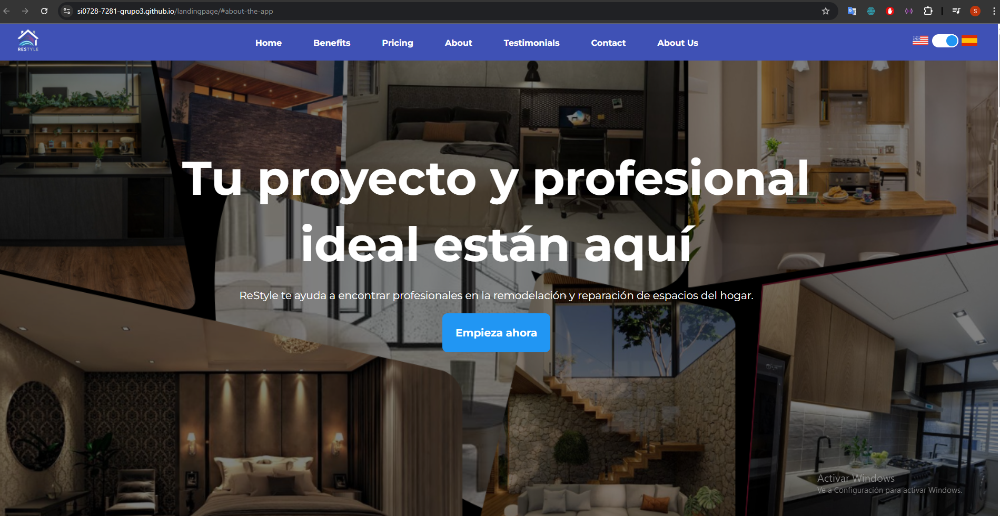
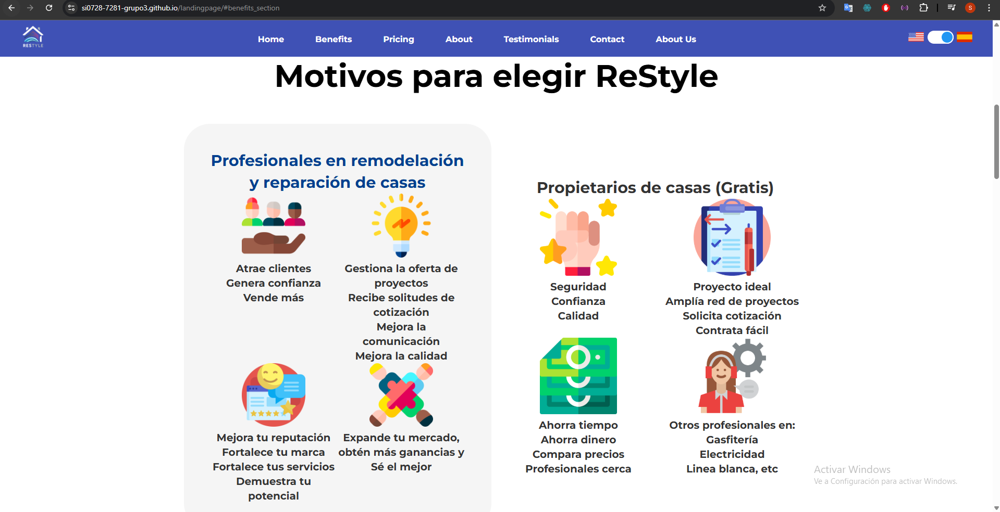
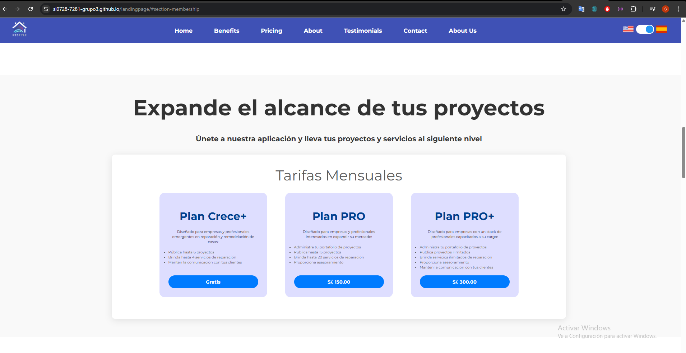
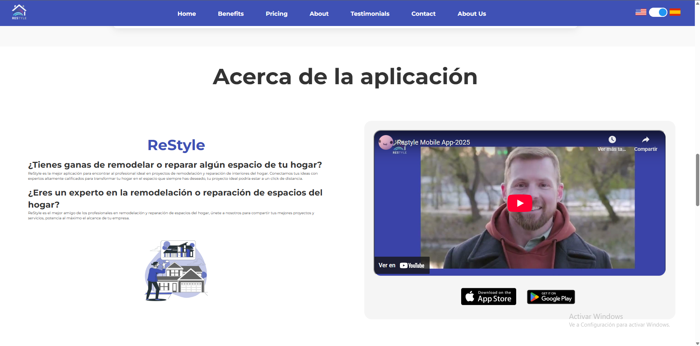
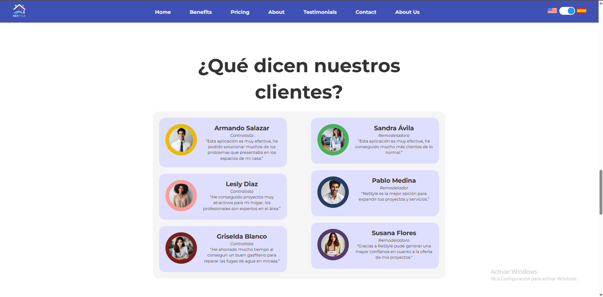
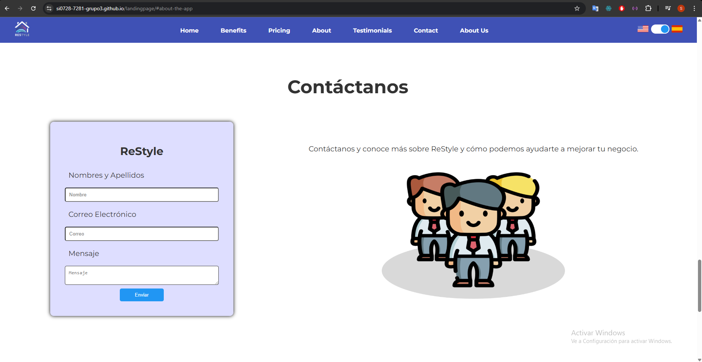
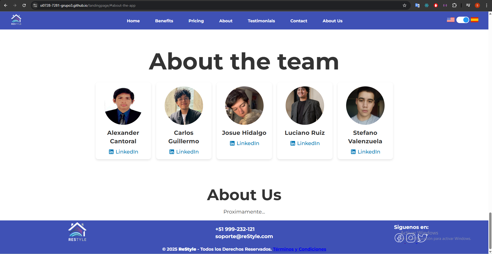

###### Implemented Frontend-Web Application Evidence
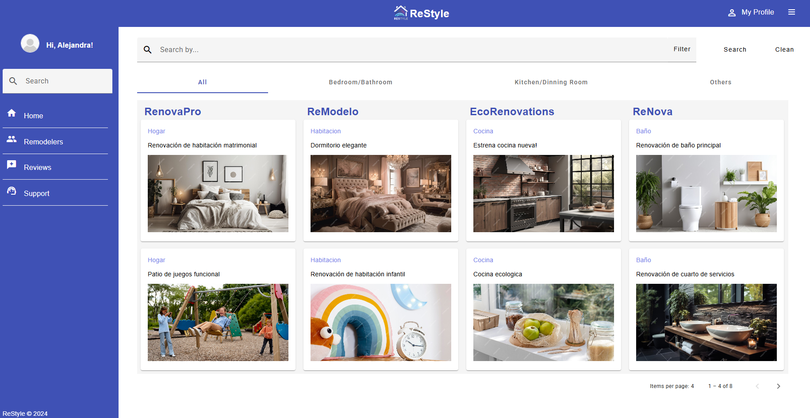
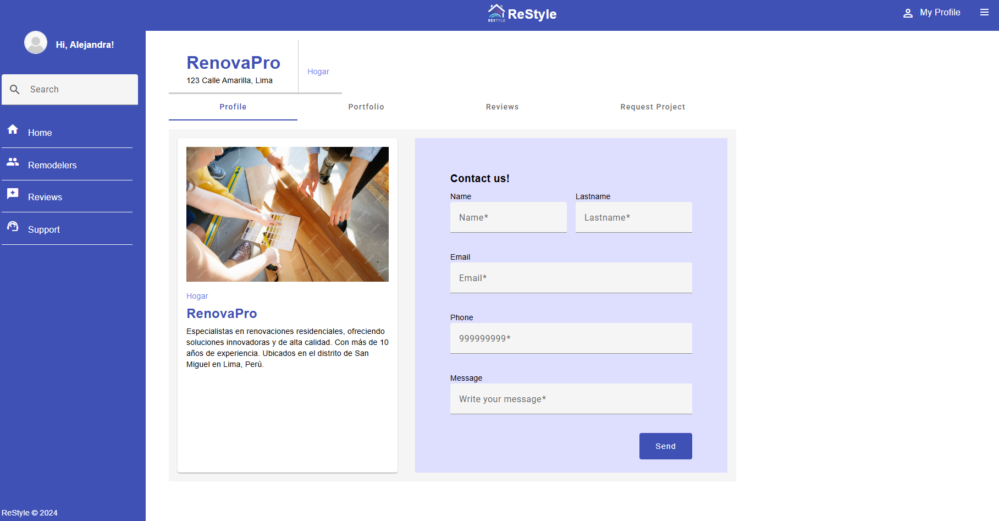
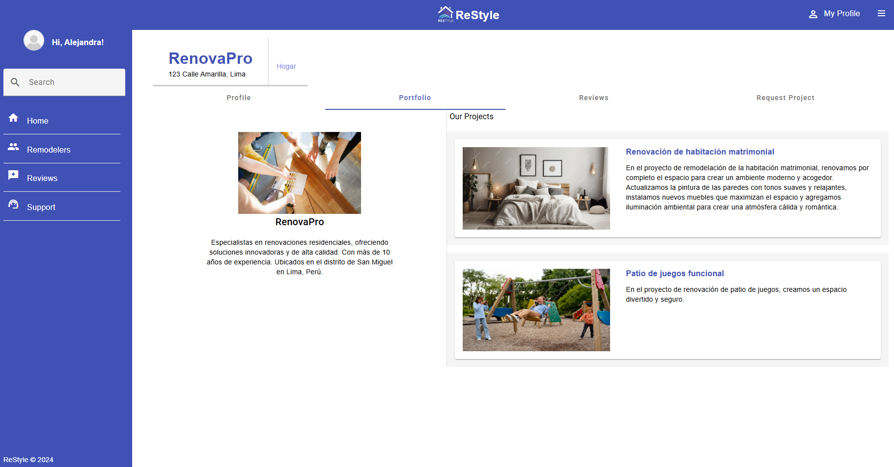

###### Implemented Native-Mobile Application Evidence
Demo: [Link dek APK](https://github.com/SI0728-7281-Grupo3/front-mobile/releases/download/TB2/re-style.apk )
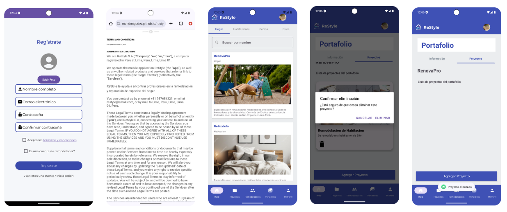

###### Implemented RESTful API and/or Serverless Backend Evidence
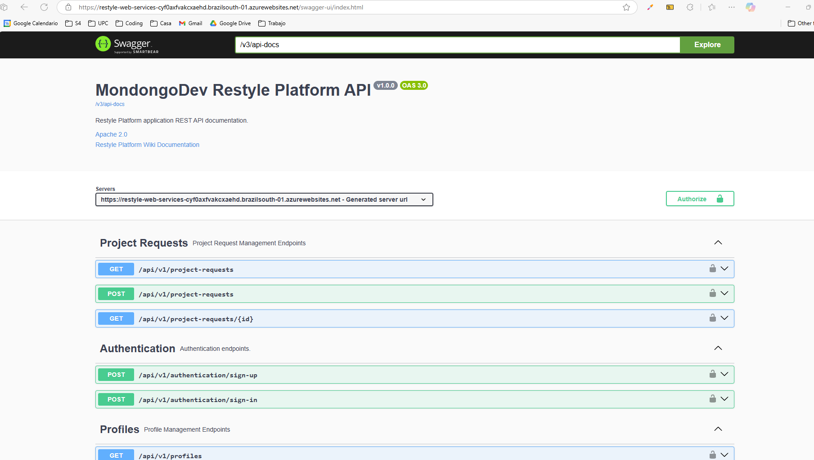
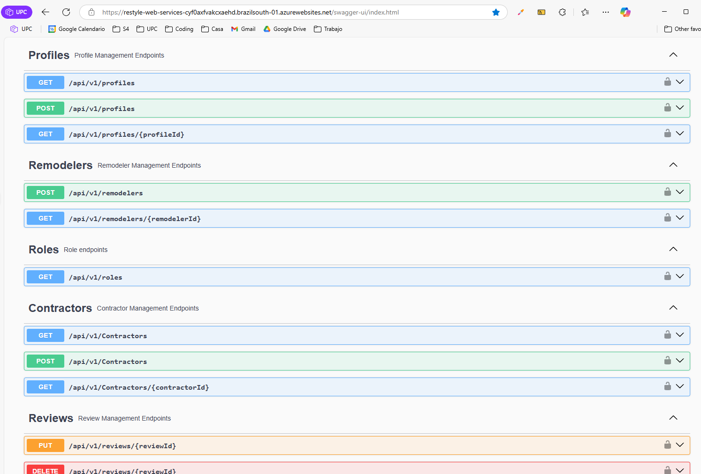
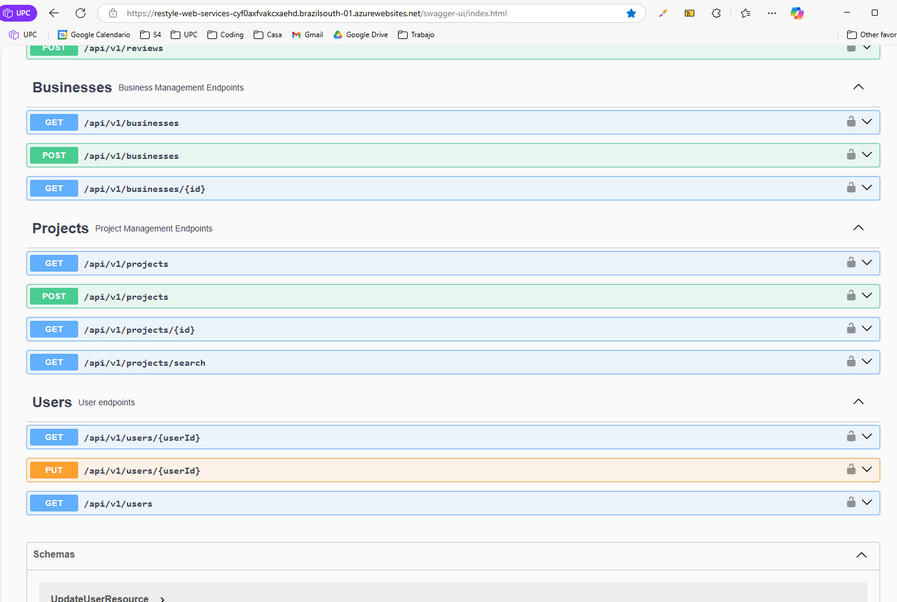
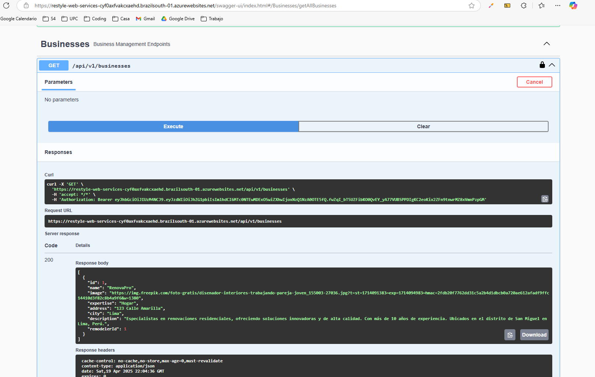

#### 7.2.1.6. Services Documentation Evidence for Sprint Review

Documentación de la API en Swagger/OpenAPI:
- Swagger UI: https://restyle-web-services-cyf0axfvakcxaehd.brazilsouth-01.azurewebsites.net/swagger-ui/index.html

Capturas de la documentación:

#### 7.2.1.7. Software Deployment Evidence for Sprint Review

Despliegues realizados y accesos. Actualizar fechas/horas según última publicación.

| Ambiente | Componente | URL | Deploy by | Fecha/Hora (GMT-5) | Evidencia |
|---|---|---|---|---|---|
| Production (GitHub Pages) | Landing Page | https://si0728-7281-grupo3.github.io/landingpage/#about-the-app | Equipo | YYYY-MM-DD HH:mm | Ver 7.2.1.5 (landing1–7.png) |
| Production (Netlify) | Frontend Web | https://restyle-frontend.netlify.app/home | Equipo | YYYY-MM-DD HH:mm | Ver 7.2.1.5 (frontend.png–3.png) |
| Production (Azure App Service) | Backend API (Swagger) | https://restyle-web-services-cyf0axfvakcxaehd.brazilsouth-01.azurewebsites.net/swagger-ui/index.html | Equipo | YYYY-MM-DD HH:mm | Ver 7.2.1.5 (web-service1–4.png) |
| Release (GitHub Releases) | Mobile APK | https://github.com/SI732-ExpDesign-Team/mobile/releases/download/v0.2.0-alpha/ReStyle.apk | Equipo | YYYY-MM-DD HH:mm | Ver 7.2.1.5 (release-mobile2.png) |

#### 7.2.1.8. Team Collaboration Insights during Sprint
En esta entrega, nuestra meta principal fue la implementación y despliegue de las soluciones de software. Para llevar a cabo este objetivo, hicimos uso de diversas herramientas como GitHub, Visual Studio Code, WebStorm y otros. A continuación, vamos a presentar los diagramas de flujo que representan los commits realizados por cada miembro del equipo:

Repositorio de project-report:
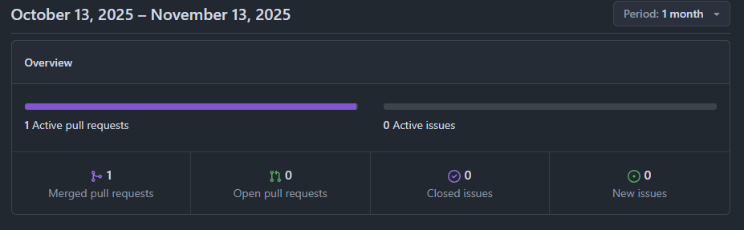 
Repositorio de landing page:
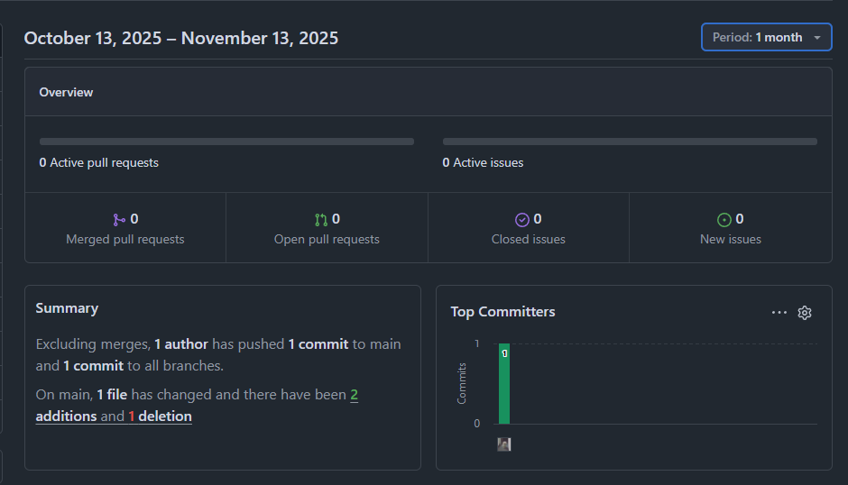 
Repositorio de frontend:
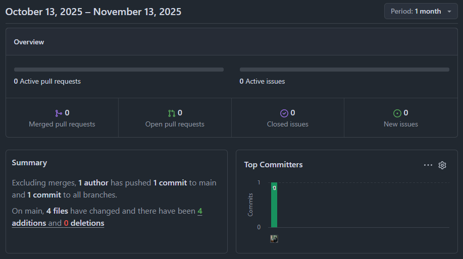 
Repositorio de web services:
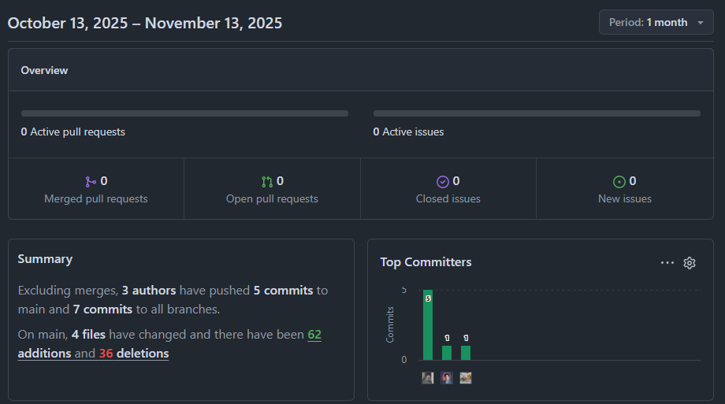 
Repositorio de mobile:
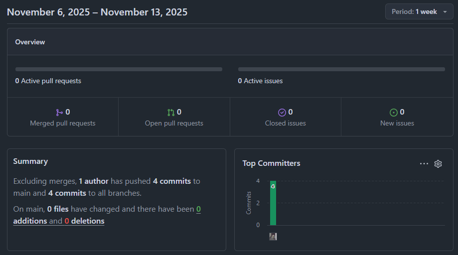 

## 7.3. Validation Interviews
#### 7.3.1. Diseño de Entrevistas

#### **Segmento Objetivo 1: Contratistas en búsqueda de servicios de remodelación**

**Propósito de la entrevista:**  
Recolectar la opinión directa de contratistas o propietarios que desean contratar servicios de remodelación a través de la plataforma. Se busca conocer sus expectativas, problemas actuales en la búsqueda y contratación de remodeladores, así como validar si la solución de Restyle facilita una experiencia más eficiente, confiable y personalizada.

**Preguntas demográficas:**
1. ¿Cuál es su nombre completo?
2. ¿Cuál es su edad?
3. ¿En qué distrito reside?
4. ¿Cuál es su ocupación actual?
5. ¿Con qué frecuencia requiere servicios de remodelación?

**Interacción con la aplicación web:**  
Se invitará al entrevistado a utilizar la funcionalidad de búsqueda personalizada por ubicación y tipo de servicio, explorar perfiles de remodeladores, leer reseñas y simular una programación de consulta. Se observará su navegación y reacciones frente a cada función.

**Preguntas sobre la experiencia con la web:**
- ¿Le resultó intuitivo buscar remodeladores según su necesidad?
- ¿Considera útil poder filtrar por especialidades o ubicación?
- ¿Le parecieron útiles las opiniones y calificaciones de otros usuarios?
- ¿Programaría una consulta desde la plataforma en una situación real?
- ¿Qué elementos o funcionalidades cree que mejorarían la experiencia?

---

### **Segmento Objetivo 2: Remodeladores registrados en la plataforma**

**Propósito de la entrevista:**  
Comprender la experiencia del remodelador al utilizar la plataforma Restyle para ofrecer sus servicios. Se evaluará la facilidad para crear un perfil profesional, recibir solicitudes de consulta, gestionar opiniones de clientes y la percepción general del sistema como canal de captación de clientes.

**Preguntas demográficas:**
1. ¿Cuál es su nombre completo?
2. ¿Qué tipo de servicios de remodelación ofrece?
3. ¿En qué distritos trabaja actualmente?
4. ¿Cuántos años de experiencia tiene en el rubro?
5. ¿Trabaja de forma independiente o con una empresa?

**Interacción con la aplicación web:**  
Se invitará al remodelador a crear un perfil de servicio, revisar cómo se muestran sus datos al público, visualizar críticas de usuarios y probar la función de gestión de consultas programadas.

**Preguntas sobre la experiencia con la web:**
- ¿Fue sencillo crear y personalizar su perfil como remodelador?
- ¿Considera adecuada la forma en que los clientes pueden contactarlo?
- ¿Cree que las reseñas y valoraciones afectan positivamente su visibilidad?
- ¿Recibir solicitudes desde la plataforma le resulta útil para captar clientes?
- ¿Qué mejoras o funcionalidades adicionales le gustaría ver como profesional?

#### 7.3.2. Registro de Entrevistas

**Entrevistas a remodeladores:** 

|**Entrevistado 1** |**InnovaInteriores** |
| :-: | :-: |
|Edad | |
|Distrito | |
| | |
|Timing: | [URL]() |
|**Entrevistado 2** |**Carlos Mendez** |
|Edad | |
|Distrito | |
| | |
|Timing: | [URL]() |
|**Entrevistado 3** |**Diego Bastidas** |
|Edad | |
|Distrito | |
| | |
|Timing: | [URL]() |

**Entrevistas a contratistas:** 

|**Entrevistado 1** |**Jakeline Morey** |
| :-: | :-: |
|Edad | |
|Distrito | |
| | |
|Timing: | [URL]() |
|**Entrevistado 2** |**Leonardo Moreno** |
|Edad | |
|Distrito | |
| | |
|Timing: | [URL]() |
|**Entrevistado 3** |**Fabian Reyes** |
|Edad | |
|Distrito | |
| | |
|Timing: | [URL]() |

#### 7.3.3. Evaluaciones según heurísticas

**Usability** \- **Inclusive Design** \- **Information Architecture**

| CARRERA | Ingeniería de Software |
| ----- | ----- |
| **CURSO** | 1ASI0728 |
| **SECCIÓN** | 7281 |
| **PROFESORES** | Berrocal Navarro, Richard Leonardo |
| **CLIENTE(S)** | - |

##### **SITE o APP A EVALUAR:**

**Landing Page y Prototipo de App Web**

### **TAREAS A EVALUAR:**

El alcance de esta evaluación incluye la revisión de la usabilidad de las siguientes tareas:
1. Visualización y navegación del Landing Page.
2. Exploración de funcionalidades en el prototipo de la app.
3. Registro real de usuario.
4. Flujo del tipo de usuario designado. 

**ESCALA DE SEVERIDAD:**

Los errores serán puntuados tomando en cuenta la siguiente escala de severidad:

| Nivel | Descripción |
| ----- | ----- |
| 1 | Problema superficial: ocurre con muy poca frecuencia y no interfiere significativamente con la tarea. |
| 2 | Problema menor: ocurre ocasionalmente y dificulta un poco la tarea; prioridad baja de corrección. |
| 3 | Problema mayor: ocurre frecuentemente o impide avanzar sin ayuda; prioridad alta de corrección. |
| 4 | Problema muy grave: bloquea por completo la tarea; debe corregirse antes del lanzamiento. |

---
#### **TABLA RESUMEN:**

---

#### **DESCRIPCIÓN DE PROBLEMAS:**
##### **PROBLEMA \#1:**

* **Severidad:** 

* **Heurística violada:** 

* **Descripción:** 

* **Recomendación:**

---

## 7.4. Video About-the-Product
<b>ReStyle</b>
¿Tienes ganas de remodelar o reparar algún espacio de tu hogar?
ReStyle es la mejor aplicación para encontrar al profesional ideal en proyectos de remodelación y reparación de interiores del hogar. Conectamos tus ideas con expertos altamente calificados para transformar tu hogar en el espacio que siempre has deseado, tu proyecto ideal podría estar a un click de distancia.

¿Eres un experto en la remodelación o reparación de espacios del hogar?
ReStyle es el mejor amigo de los profesionales en remodelación y reparación de espacios del hogar, únete a nosotros para compartir tus mejores proyectos y servicios, potencia al máximo el alcance de tu empresa.

<b>Video About-the-Product:</b>
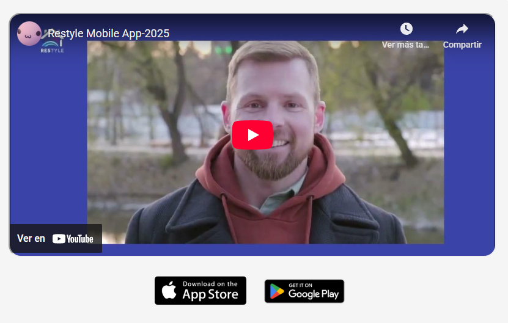 

## 7.5. Conclusiones

En base al trabajo realizado en las secciones previas, se presentan las siguientes conclusiones y recomendaciones:

- La solución propuesta cubre las necesidades principales de los segmentos objetivo y prioriza funcionalidades esenciales: búsqueda, portafolios, solicitudes/cotizaciones, seguimiento por hitos.
- El diseño UX favorece coherencia, accesibilidad y adaptabilidad a dispositivos.
- La arquitectura en bounded contexts garantiza separación de responsabilidades y escalabilidad.
- Recomendaciones: (1) API segura e idempotente; (2) read-model para discovery; (3) integración robusta con PSP y validación de webhooks; (4) cola/worker para tareas asíncronas.
- Implementar plan de pruebas, validación de rendimiento y guía de despliegue segura.

## 7.6. Bibliografía

- INEI. https://www.inei.gob.pe  
- Ipsos Perú. https://www.ipsos.com  
- Microsoft News Center LATAM. https://news.microsoft.com/latam  
- Apple Human Interface Guidelines. https://developer.apple.com/design/human-interface-guidelines/  
- Material Design. https://material.io  
- PostgreSQL Documentation. https://www.postgresql.org/docs/  
- Nielsen Norman Group. https://www.nngroup.com

## 7.7. Anexos

Enlaces y artefactos relevantes del proyecto:

- Despliegues / Aplicaciones:
  - Landing Page (repo): https://github.com/SI0728-7281-Grupo3/landingpage
  - Frontend (repo): https://github.com/SI0728-7281-Grupo3/frontend-main
  - Backend (repo): https://github.com/SI0728-7281-Grupo3/backend-main
  - Mobile (repo): https://github.com/SI0728-7281-Grupo3/mobile-main

- Diagramas y documentación:
  - Diagramas del Capítulo V: report/assets/img/chapter-V/Diagrams-BC/
  - Vertabelo project: vertabelo-db-diagram/diagrams/vertabelo/vertabelo-project.vdb
  - SQL exports: vertabelo-db-diagram/diagrams/exports/ (erd.sql, erd.xml, erd.json)
  - Esquemas SQL: vertabelo-db-diagram/sql/schema/01_schema.sql, vertabelo-db-diagram/sql/schema/02_simple_schema.sql

- Repositorios (ejemplos):
  - Organización / repos: ver sección 7.1.2 (URLs)

- Checklist de entrega mínima:
  - Endpoints documentados en Swagger.
  - Esquema SQL aplicado en staging.
  - Webhooks con verificación HMAC y pruebas de idempotencia.
  - Worker/cola configurada para tareas asíncronas.
  - Plan de pruebas de usabilidad y pruebas de rendimiento básicas.

-- Fin de Capítulo VII
