# Capítulo VII: Product Implementation, Validation & Deployment

## 7.1. Software Configuration Management

En este punto del informe se describen las decisiones y los principios que ayudarán al equipo a garantizar la coherencia durante el desarrollo de la solución.

### 7.1.1. Software Development Environment Configuration

En este apartado se listan las aplicaciones y productos de software usados durante el ciclo del proyecto, organizados por disciplina.

Project Management:
- Trello: Gestión de tareas y proyectos. https://trello.com/signup
- Miro: Planificación visual, mapas mentales y diagramas. https://miro.com/signup
- OneDrive: Almacenamiento y colaboración de documentos y recursos del proyecto (sustituye a Google Drive). https://www.microsoft.com/microsoft-365/onedrive/
- GitHub Desktop: Gestión local de repositorios y sincronización con GitHub. https://desktop.github.com/

Requirements Management:
- Lucidchart: Diagramado de flujos y requisitos. https://www.lucidchart.com/users/register
- Google Forms: Recolección de feedback y encuestas. https://www.google.com/forms/about/

Product UX/UI Design:
- Uxpressia: Mapas de impacto, Personas y Journey Maps. https://uxpressia.com
- Miro: Pizarra colaborativa para ideación y workshops. https://miro.com
- Figma: Prototipos, wireframes y diseños de UI. https://www.figma.com/signup
- Lucidchart / Overflow: Diagramación de flujos y userflows. https://www.lucidchart.com / https://overflow.io

Software Development:
- IDEs:
  - Visual Studio Code: principal IDE del equipo. https://code.visualstudio.com/download
  - Android Studio: emulación y pruebas móviles Android. https://developer.android.com/studio
- Control de Versiones: Git con integración a GitHub. https://git-scm.com/downloads
- Gestión de Dependencias:
  - Flutter Pub / Pub.dev (cuando aplica): https://pub.dev/
- Herramientas de Construcción:
  - Gradle (cuando aplica): https://docs.gradle.org/current/userguide/userguide.html

Software Testing:
- Lenguaje Gherkin para especificaciones ejecutables (BDD) y pruebas automatizadas.

Software Documentation:
- GitHub: documentación en README.md y wikis. https://github.com/join
- Structurizr: documentación de arquitectura. https://structurizr.com/

### 7.1.2. Source Code Management

Descripción del SCM adoptado y repositorios relevantes.

- Modelo de ramas: GitFlow (main, develop, feature/*, release/*, hotfix/*).
- Reglas: Pull requests con revisión por pares, CI en cada PR y protección de ramas.
- Organización / Repositorios (ejemplos):
  - Organización: SI0728-7281-Grupo3 - https://github.com/SI0728-7281-Grupo3
  - Landing page: https://github.com/SI0728-7281-Grupo3/landingpage
  - Frontend: https://github.com/SI0728-7281-Grupo3/frontend-main
  - Backend: https://github.com/SI0728-7281-Grupo3/backend-main
  - Mobile: https://github.com/SI0728-7281-Grupo3/mobile-main

GitFlow y convenciones:
- Ramas principales: main, develop.
- Ramas de soporte: feature/* (desde develop -> a develop), release/*, hotfix/* (desde main).
- Nomenclatura de features: feature/<short-desc>
- Commits: utilizar Conventional Commits (feat, fix, chore, docs, refactor, test, etc.)

### 7.1.3. Source Code Style Guide & Conventions

Pautas generales para mantener la legibilidad y calidad del código:

- Linters y formatters: ESLint + Prettier para JS/TS, formato consistente para HTML/CSS, reglas de estilo para Java/Flutter según linters oficiales.
- Convenciones de commits: Conventional Commits.
- Nomenclatura: nombres en inglés, descriptivos y consistentes; usar camelCase en JS/TS, PascalCase en clases Java/TS.

Especificaciones por lenguaje (resumen):
- HTML: DOCTYPE HTML5, atributos con comillas dobles, mantener , líneas en blanco entre secciones.
- CSS: uso de shorthand, punto y coma en declaraciones, espacio después de ":".
- JavaScript / TypeScript: punto y coma al final, espacios alrededor de operadores, funciones con llave en la misma línea.
- Java: clases como sustantivos en PascalCase, métodos en camelCase, tratar excepciones con justificación.
- Gherkin: Given-When-Then con sangría clara; uso de tablas para valores; reducción de ruido con valores por defecto entre comillas simples.

(Ver sección completa de convenciones en la documentación del repo para ejemplos y plantillas.)

### 7.1.4. Software Deployment Configuration

Pautas de CI/CD, gestión de secretos y estrategias de despliegue:

- Pipelines: cada repositorio debe incluir pipeline CI que ejecute lint, tests y build. PRs ejecutan CI; merges a main disparan CD.
- Variables y secretos: uso de GitHub Secrets / KeyVault / Azure App Configuration según entorno.
- Estrategias de despliegue: rolling/blue-green para servicios críticos; Canary releases para funciones nuevas.
- Documentación de pasos de despliegue en cada repo (README / docs/deploy.md).

## 7.2. Solution Implementation

### 7.2.1. Sprint 1

#### 7.2.1.1. Sprint Planning 1

Sprint # | Sprint 1
---|---
Sprint Planning Background | Sprint de implementación y despliegue inicial (Landing, Backend API, Frontend Web y Mobile APK). Preparar demo, URLs públicas y documentación de evidencias.
Date | 2025-10-03
Time | 07:00 PM (GMT-5)
Location | Reunión virtual por Microsoft Teams
Prepared By | Stefano Alessandro Valenzuela Vallejos
Attendees (planning meeting) | Alexander Alberto Cantoral Sedamano / Carlos Raúl Guillermo Chávez Rojas / Josue Omar Hidalgo Bustamante / Luciano Stefano Ruiz Blas / Stefano Alessandro Valenzuela Vallejos
Sprint n−1 — Review Summary | N/A (primer sprint del proyecto)
Sprint n−1 — Retrospective Summary | N/A (primer sprint del proyecto)
Sprint n Goal | Publicar en producción los cuatro componentes con CI básico y documentar evidencias en el Capítulo VII. Métrica: 100% de tareas de despliegue “Done”, 4 URLs operativas y registradas.
Sprint n Velocity | 16 SP
Sum of Story Points | 16 SP

#### 7.2.1.2. Sprint Backlog 1

Durante el desarrollo de este Sprint nos enfocamos en los despliegues de los entregables: Landing page, Web services, Frontend web application y Mobile application.

<table>
  <tr>
    <td> <strong>Sprint #</strong></td>
    <td colspan="7"> <strong>Sprint 1</strong> </td>
  </tr>

  <tr>
    <td colspan="2"> <strong>User Story</strong></td>
    <td colspan="6"> <strong>Work-item / Task</strong></td>
  </tr>

  <tr>
    <td> <strong>ID</strong> </td>
    <td> <strong>Title</strong></td>
    <td> <strong>ID</strong> </td>
    <td> <strong>Title</strong></td>
    <td> <strong>Description</strong></td>
    <td> <strong>Estimation (Hours)</strong></td>
    <td> <strong>Assigned To</strong></td>
    <td> <strong>Status (To-do / In-Process / To-Review / Done)</strong></td>
  </tr>

  <!-- US-001 Landing Page -->
  <tr>
    <td rowspan="3">US-001</td>
    <td rowspan="3">Implementación y despliegue de Landing Page</td>
    <td>UT-01</td>
    <td>Crear repositorio de landing page y ramas</td>
    <td>Crear el repositorio dentro de la organización en GitHub y establecer GitFlow</td>
    <td>1</td>
    <td>Alexander Alberto Cantoral Sedamano</td>
    <td>Done</td>
  </tr>
  <tr>
    <td>UT-02</td>
    <td>Implementación del Landing Page</td>
    <td>Implementar la landing page con contenido del proyecto</td>
    <td>2</td>
    <td>Luciano Stefano Ruiz Blas</td>
    <td>Done</td>
  </tr>
  <tr>
    <td>UT-03</td>
    <td>Despliegue del Landing Page</td>
    <td>Desplegar la landing page mediante GitHub Pages</td>
    <td>1</td>
    <td>Stefano Alessandro Valenzuela Vallejos</td>
    <td>Done</td>
  </tr>

  <!-- US-002 Web Services -->
  <tr>
    <td rowspan="3">US-002</td>
    <td rowspan="3">Implementación y despliegue de Web Services</td>
    <td>UT-01</td>
    <td>Crear repositorio de web services y ramas</td>
    <td>Crear repositorio en la organización y configurar pipeline CI</td>
    <td>1</td>
    <td>Josue Omar Hidalgo Bustamante</td>
    <td>Done</td>
  </tr>
  <tr>
    <td>UT-02</td>
    <td>Implementación de Web Services</td>
    <td>Desarrollar endpoints necesarios y pruebas básicas</td>
    <td>2</td>
    <td>Alexander Alberto Cantoral Sedamano</td>
    <td>Done</td>
  </tr>
  <tr>
    <td>UT-03</td>
    <td>Despliegue de Web Services</td>
    <td>Desplegar los web services en un hosting (Azure / App Service)</td>
    <td>1</td>
    <td>Carlos Raúl Guillermo Chávez Rojas</td>
    <td>Done</td>
  </tr>

  <!-- US-003 Frontend Web Application -->
  <tr>
    <td rowspan="3">US-003</td>
    <td rowspan="3">Implementación y despliegue de Frontend Web Application</td>
    <td>UT-01</td>
    <td>Crear repositorio de Frontend y ramas</td>
    <td>Crear repositorio en la organización y configurar CI/CD (Netlify / Vercel)</td>
    <td>1</td>
    <td>Carlos Raúl Guillermo Chávez Rojas</td>
    <td>Done</td>
  </tr>
  <tr>
    <td>UT-02</td>
    <td>Implementación del Frontend</td>
    <td>Desarrollar interfaces y conectar con API</td>
    <td>2</td>
    <td>Stefano Alessandro Valenzuela Vallejos</td>
    <td>Done</td>
  </tr>
  <tr>
    <td>UT-03</td>
    <td>Despliegue del Frontend</td>
    <td>Desplegar la aplicación web en hosting público</td>
    <td>1</td>
    <td>Luciano Stefano Ruiz Blas</td>
    <td>Done</td>
  </tr>

  <!-- US-004 Mobile Application -->
  <tr>
    <td rowspan="3">US-004</td>
    <td rowspan="3">Implementación y despliegue de Mobile Application</td>
    <td>UT-01</td>
    <td>Crear repositorio de Mobile y ramas</td>
    <td>Crear repositorio y configurar workflow para builds (APK/IPA)</td>
    <td>1</td>
    <td>Stefano Alessandro Valenzuela Vallejos</td>
    <td>Done</td>
  </tr>
  <tr>
    <td>UT-02</td>
    <td>Implementación del Mobile</td>
    <td>Desarrollar pantallas principales y funciones básicas</td>
    <td>2</td>
    <td>Josue Omar Hidalgo Bustamante</td>
    <td>Done</td>
  </tr>
  <tr>
    <td>UT-03</td>
    <td>Despliegue del Mobile</td>
    <td>Publicar release (APK) en GitHub Releases</td>
    <td>1</td>
    <td>Alexander Alberto Cantoral Sedamano</td>
    <td>Done</td>
  </tr>
</table>

#### 7.2.1.3. Development Evidence for Sprint Review

Registro de commits relevantes del repositorio report (capturas del historial de commits).

Repository | Branch | Commit Id | Commit Message | Author | Date | URL
---|---|---|---|---|---|---
SI0728-7281-Grupo3/report | — | 8584c1d | Update chapter-VII.md | AlessandroUPC | 2025-11-10 | https://github.com/SI0728-7281-Grupo3/report/commit/8584c1d7e47b130c047422cdc91c235baefec1e6
SI0728-7281-Grupo3/report | — | 574fc1c | feat: update model | AlessandroUPC | 2025-11-03 | https://github.com/SI0728-7281-Grupo3/report/commit/574fc1c
SI0728-7281-Grupo3/report | dev-stef / develop | 539772a | Merge pull request #14 from SI0728-7281-Grupo3/dev-stef | AlessandroUPC (authored) | 2025-11-02 | https://github.com/SI0728-7281-Grupo3/report/commit/539772a
SI0728-7281-Grupo3/report | dev-stef / develop | 5e9d1c8 | Merge branch 'develop' into dev-stef | AlessandroUPC (authored) | 2025-10-08 | https://github.com/SI0728-7281-Grupo3/report/commit/5e9d1c8
SI0728-7281-Grupo3/report | — | 815333f | Update chapter-VI.md | AlessandroUPC | 2025-10-07 | https://github.com/SI0728-7281-Grupo3/report/commit/815333f
SI0728-7281-Grupo3/report | — | 2ce7f62 | Create chapter-V.md | AlessandroUPC | 2025-10-04 | https://github.com/SI0728-7281-Grupo3/report/commit/2ce7f62
SI0728-7281-7281-Grupo3/report | develop | 61795bc | Merge branch 'develop' of https://github.com/SI0728-7281-Grupo3/report into develop | AlessandroUPC | 2025-09-18 | https://github.com/SI0728-7281-7281-Grupo3/report/commit/61795bc
SI0728-7281-Grupo3/report | develop-carlos | 24f7190 | feat: Impact Mapping added | CarlosChavez19 | 2025-09-18 | https://github.com/SI0728-7281-Grupo3/report/commit/24f7190

#### 7.2.1.4. Testing Suite Evidence for Sprint Review

A continuación, se presenta una tabla con información del repositorio de las pruebas, y los commits realizados durante el sprint:

| Repository                                | Branch | Commit Id | Commit Message                                                                | Commit Message Body | Commited on (Date) |
|-------------------------------------------|--------|-----------|-------------------------------------------------------------------------------|----------------------|---------------------|
| SI0728-7281-Grupo3/acceptance-test        | main   | ae4dabf   | feat: add project completion and owner review submission tests               | -                    | 30/11/2025          |
| SI0728-7281-Grupo3/acceptance-test        | main   | 71c3f4f   | feat: implement quotation acceptance and payment authorization tests         | -                    | 30/11/2025          |
| SI0728-7281-Grupo3/acceptance-test        | main   | 5cf22a2   | feat: add project request creation and technical visit scheduling tests      | -                    | 30/11/2025          |
| SI0728-7281-Grupo3/acceptance-test        | main   | ad4a587   | feat: implement remodeler discovery tests (location + rating filtering)      | -                    | 30/11/2025          |
| SI0728-7281-Grupo3/acceptance-test        | main   | 4beefc7   | feat: add Gherkin scenarios for user registration and login                  | -                    | 30/11/2025          |

Github Link: https://github.com/SI0728-7281-Grupo3/acceptance-test/commits/main

#### 7.2.1.5. Execution Evidence for Sprint Review

Registro de commits relevantes del repositorio report (capturas del historial de commits).

Repository | Branch | Commit Id | Commit Message | Author | Date | URL
---|---|---|---|---|---|---
SI0728-7281-Grupo3/report | develop | e30d699 | Update chapter-VII.md | AlessandroUPC | 2025-11-27 | https://github.com/SI0728-7281-Grupo3/report/commit/e30d699
SI0728-7281-Grupo3/report | develop-chatbot | 5fd3e7f | feat: Complete UI implementation for chatbot | LucianRuiz | 2025-11-26 | https://github.com/SI0728-7281-Grupo3/report/commit/5fd3e7f
SI0728-7281-Grupo3/report | develop-chatbot | 6fd50d5 | feat: Implementation of chatbot improvements (response formatting, GPT-5 Nano) | LucianRuiz | 2025-11-13 | https://github.com/SI0728-7281-Grupo3/report/commit/6fd50d5
SI0728-7281-Grupo3/report | develop-chatbot | 6f507fd | feat: chatbot agent added | CarlosChavez19 | 2025-11-12 | https://github.com/SI0728-7281-Grupo3/report/commit/6f507fd
SI0728-7281-Grupo3/report | develop | 9d0f439 | Update environment.ts | CarlosChavez19 | 2025-10-06 | https://github.com/SI0728-7281-Grupo3/report/commit/9d0f439
SI0728-7281-Grupo3/report | — | 4b68b10 | commit-init | AlessandroUPC | 2025-09-08 | https://github.com/SI0728-7281-Grupo3/report/commit/4b68b10

###### Implemented Landing Page Evidence

Link:
https://si0728-7281-grupo3.github.io/landingpage/#about-the-app

###### Implemented Frontend-Web Application Evidence

Link: 
https://si0728-7281-grupo3.github.io/landingpage/#about-the-app

###### Implemented Native-Mobile Application Evidence
Demo: [Link dek APK](https://github.com/SI0728-7281-Grupo3/front-mobile/releases/download/TB2/re-style.apk )

###### Implemented RESTful API and/or Serverless Backend Evidence

#### 7.2.1.6. Services Documentation Evidence for Sprint Review

Documentación de la API en Swagger/OpenAPI:
- Swagger UI: https://restyle-platform-bed4c3b3f3eug0ak.canadacentral-01.azurewebsites.net/swagger-ui/index.html#/

Capturas de la documentación:
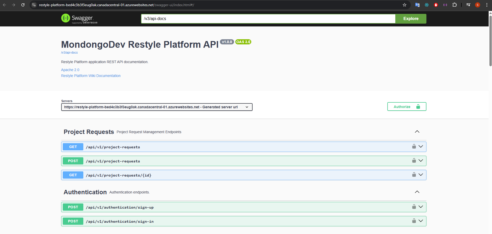

#### 7.2.1.7. Software Deployment Evidence for Sprint Review

Despliegues realizados y accesos. Actualizar fechas/horas según última publicación.

| Ambiente | Componente | URL | Deploy by | Fecha/Hora (GMT-5) | Evidencia |
|---|---|---|---|---|---|
| Production (GitHub Pages) | Landing Page | https://si0728-7281-grupo3.github.io/landingpage/#about-the-app | Equipo | YYYY-MM-DD HH:mm | Ver 7.2.1.5 (landing1–7.png) |
| Production (Netlify) | Frontend Web | https://restyle-frontend.netlify.app/ | Equipo | YYYY-MM-DD HH:mm | Ver 7.2.1.5 (frontend.png–3.png) |
| Production (Azure App Service) | Backend API (Swagger) | https://restyle-platform-bed4c3b3f3eug0ak.canadacentral-01.azurewebsites.net/swagger-ui/index.html#/ | Equipo | YYYY-MM-DD HH:mm | Ver 7.2.1.5 (web-service1–4.png) |
| Release (GitHub Releases) | Mobile APK | https://github.com/SI732-ExpDesign-Team/mobile/releases/download/v0.2.0-alpha/ReStyle.apk | Equipo | YYYY-MM-DD HH:mm | Ver 7.2.1.5 (release-mobile2.png) |

#### 7.2.1.8. Team Collaboration Insights during Sprint
En esta entrega, nuestra meta principal fue la implementación y despliegue de las soluciones de software. Para llevar a cabo este objetivo, hicimos uso de diversas herramientas como GitHub, Visual Studio Code, WebStorm y otros. A continuación, vamos a presentar los diagramas de flujo que representan los commits realizados por cada miembro del equipo:

Repositorio de project-report:
 
Repositorio de landing page:
 
Repositorio de frontend:
 
Repositorio de web services:
 
Repositorio de mobile:
 
Github: https://github.com/orgs/SI0728-7281-Grupo3/actions/metrics/usage

### 7.2.2. Sprint 2

#### 7.2.2.1. Sprint Planning 2

Sprint # | Sprint 2
---|---
Sprint Planning Background | Sprint final: consolidación, pruebas finales y despliegue definitivo de Landing, Frontend Web, Backend API, Mobile (APK) e integración del chatbot con IA. Preparar demo final y documentación de entrega.
Date | 2025-11-24
Time | 07:00 PM (GMT-5)
Location | Reunión virtual por Microsoft Teams
Prepared By | Stefano Alessandro Valenzuela Vallejos
Attendees (planning meeting) | Alexander Alberto Cantoral Sedamano / Carlos Raúl Guillermo Chávez Rojas / Josue Omar Hidalgo Bustamante / Luciano Stefano Ruiz Blas / Stefano Alessandro Valenzuela Vallejos
Sprint n−1 — Review Summary | Resultados del Sprint 1: despliegues iniciales y evidencias registradas; base estable para integración.
Sprint n−1 — Retrospective Summary | Mejoras: más pruebas automatizadas, pipeline de despliegue más robusto, definición de responsables de post-deploy.
Sprint n Goal | Entregar en producción todos los componentes con QA aprobado, integrar chatbot IA y entregar documentación final y video demo. Métrica: 100% de endpoints documentados, demo funcional, chatbot integrado y 5 URLs operativas.
Sprint n Velocity | 20 SP
Sum of Story Points | 20 SP

#### 7.2.2.2. Sprint Backlog 2

<table>
  <tr>
    <td> <strong>Sprint #</strong></td>
    <td colspan="7"> <strong>Sprint 2</strong> </td>
  </tr>

  <tr>
    <td colspan="2"> <strong>User Story</strong></td>
    <td colspan="6"> <strong>Work-item / Task</strong></td>
  </tr>

  <tr>
    <td> <strong>ID</strong> </td>
    <td> <strong>Title</strong></td>
    <td> <strong>ID</strong> </td>
    <td> <strong>Title</strong></td>
    <td> <strong>Description</strong></td>
    <td> <strong>Estimation (Hours)</strong></td>
    <td> <strong>Assigned To</strong></td>
    <td> <strong>Status (To-do / In-Process / To-Review / Done)</strong></td>
  </tr>

  <!-- US-005: Final Deployment -->
  <tr>
    <td rowspan="3">US-005</td>
    <td rowspan="3">Despliegue final y hardening de infraestructura</td>
    <td>UT-01</td>
    <td>Pipeline CD final</td>
    <td>Configurar y validar workflows de CI/CD para producción (frontend, backend, mobile)</td>
    <td>6</td>
    <td>Alexander Alberto Cantoral Sedamano</td>
    <td>To-do</td>
  </tr>
  <tr>
    <td>UT-02</td>
    <td>Smoke tests post-deploy</td>
    <td>Automatizar smoke tests y checklist de post-deploy</td>
    <td>4</td>
    <td>Carlos Raúl Guillermo Chávez Rojas</td>
    <td>To-do</td>
  </tr>
  <tr>
    <td>UT-03</td>
    <td>Rollback & runbook</td>
    <td>Documentar pasos de rollback y runbook de despliegue</td>
    <td>3</td>
    <td>Stefano Alessandro Valenzuela Vallejos</td>
    <td>To-do</td>
  </tr>

  <!-- US-006: Chatbot IA -->
  <tr>
    <td rowspan="3">US-006</td>
    <td rowspan="3">Integración de chatbot con IA</td>
    <td>UT-01</td>
    <td>Diseño e IA model</td>
    <td>Definir flujo conversacional y seleccionar proveedor/modelo IA</td>
    <td>4</td>
    <td>Luciano Stefano Ruiz Blas</td>
    <td>To-do</td>
  </tr>
  <tr>
    <td>UT-02</td>
    <td>Implementación backend</td>
    <td>Crear endpoints y adaptadores para integración con servicio de IA</td>
    <td>6</td>
    <td>Josue Omar Hidalgo Bustamante</td>
    <td>To-do</td>
  </tr>
  <tr>
    <td>UT-03</td>
    <td>Integración frontend/mobile</td>
    <td>Agregar UI de chat en web y mobile y conectar con backend</td>
    <td>5</td>
    <td>Stefano Alessandro Valenzuela Vallejos</td>
    <td>To-do</td>
  </tr>

  <!-- US-007: QA & Testing -->
  <tr>
    <td rowspan="3">US-007</td>
    <td rowspan="3">Pruebas finales y aseguramiento de calidad</td>
    <td>UT-01</td>
    <td>Tests E2E completos</td>
    <td>Crear/ejecutar suites E2E para flujos críticos (registro, búsqueda, contratación, chat)</td>
    <td>6</td>
    <td>Alexander Alberto Cantoral Sedamano</td>
    <td>To-do</td>
  </tr>
  <tr>
    <td>UT-02</td>
    <td>Pruebas de carga básicas</td>
    <td>Ejecutar pruebas de carga en endpoints críticos</td>
    <td>4</td>
    <td>Carlos Raúl Guillermo Chávez Rojas</td>
    <td>To-do</td>
  </tr>
  <tr>
    <td>UT-03</td>
    <td>Corrección de bugs críticos</td>
    <td>Resolver defectos encontrados en QA y preparar release candidate</td>
    <td>6</td>
    <td>Equipo</td>
    <td>To-do</td>
  </tr>

  <!-- US-008: Documentación y entrega -->
  <tr>
    <td rowspan="3">US-008</td>
    <td rowspan="3">Documentación final, demo y entrega</td>
    <td>UT-01</td>
    <td>OpenAPI / Postman</td>
    <td>Actualizar Swagger/OpenAPI y exportar colección Postman</td>
    <td>3</td>
    <td>Josue Omar Hidalgo Bustamante</td>
    <td>To-do</td>
  </tr>
  <tr>
    <td>UT-02</td>
    <td>Video demo y release notes</td>
    <td>Grabar demo final, preparar release notes y CHANGELOG</td>
    <td>4</td>
    <td>Luciano Stefano Ruiz Blas</td>
    <td>To-do</td>
  </tr>
  <tr>
    <td>UT-03</td>
    <td>Checklist de entrega</td>
    <td>Verificar checklist mínimo: endpoints, despliegues, accesos y evidencias</td>
    <td>2</td>
    <td>Stefano Alessandro Valenzuela Vallejos</td>
    <td>To-do</td>
  </tr>
</table>

#### 7.2.2.3. Development Evidence for Sprint Review

<!-- Estructura: commits, PRs, ramas, enlaces a repositorios -->

#### 7.2.2.4. Testing Suite Evidence for Sprint Review

A continuación, se presenta una tabla con información del repositorio de las pruebas, y los commits realizados durante el sprint:

| Repository                                | Branch | Commit Id | Commit Message                                                                | Commit Message Body | Commited on (Date) |
|-------------------------------------------|--------|-----------|-------------------------------------------------------------------------------|----------------------|---------------------|
| SI0728-7281-Grupo3/acceptance-test        | main   | ae4dabf   | feat: add project completion and owner review submission tests               | -                    | 30/11/2025          |
| SI0728-7281-Grupo3/acceptance-test        | main   | 71c3f4f   | feat: implement quotation acceptance and payment authorization tests         | -                    | 30/11/2025          |
| SI0728-7281-Grupo3/acceptance-test        | main   | 5cf22a2   | feat: add project request creation and technical visit scheduling tests      | -                    | 30/11/2025          |
| SI0728-7281-Grupo3/acceptance-test        | main   | ad4a587   | feat: implement remodeler discovery tests (location + rating filtering)      | -                    | 30/11/2025          |
| SI0728-7281-Grupo3/acceptance-test        | main   | 4beefc7   | feat: add Gherkin scenarios for user registration and login                  | -                    | 30/11/2025          |
| SI0728-7281-Grupo3/acceptance-test        | main   | 92ee54d   | feat: add chatbot product recommendation acceptance test                     | -                    | 30/11/2025          |

Github Link: https://github.com/SI0728-7281-Grupo3/acceptance-test/commits/main

#### 7.2.1.5. Execution Evidence for Sprint Review

Evidencias de funcionamiento de cada componente (ver 7.2.1.7 para URLs de despliegue).

###### Implemented Landing Page Evidence

Link:
https://si0728-7281-grupo3.github.io/landingpage/#about-the-app

###### Implemented Frontend-Web Application Evidence

Link: 
https://si0728-7281-grupo3.github.io/landingpage/#about-the-app

###### Implemented Native-Mobile Application Evidence
Demo: [Link dek APK](https://github.com/SI0728-7281-Grupo3/front-mobile/releases/download/TB2/re-style.apk )
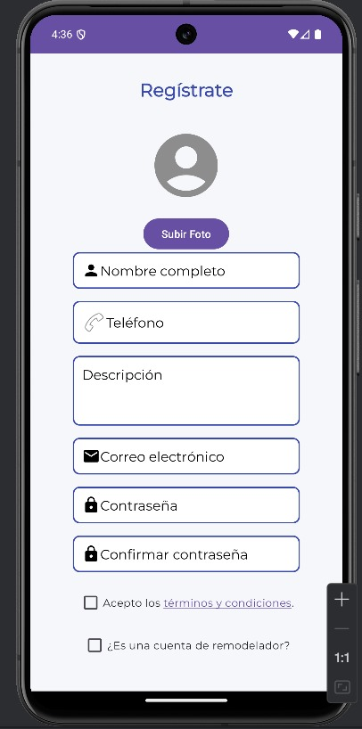
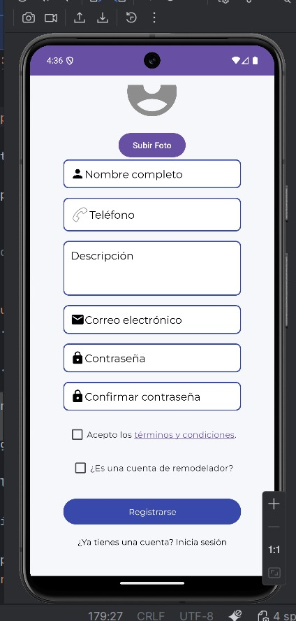
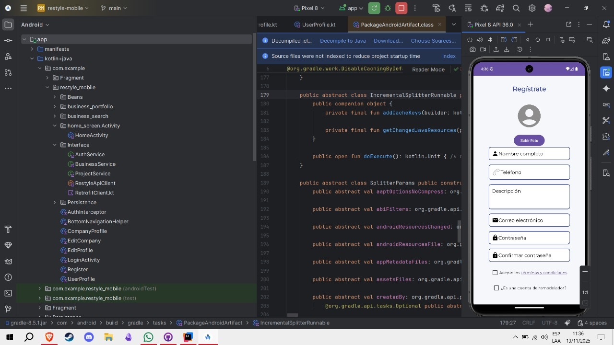
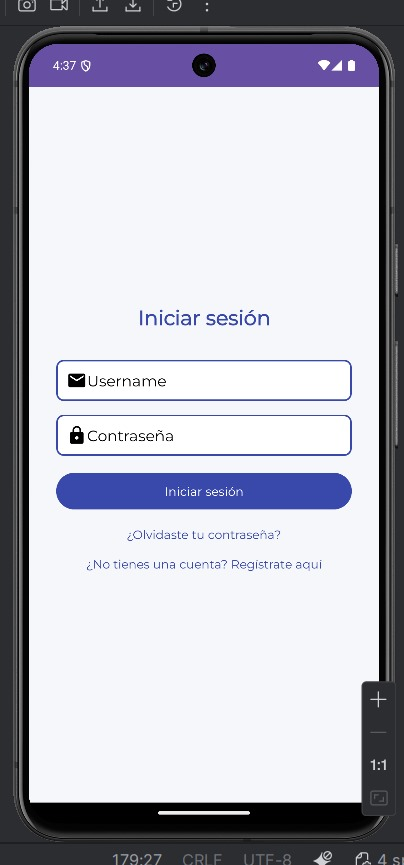
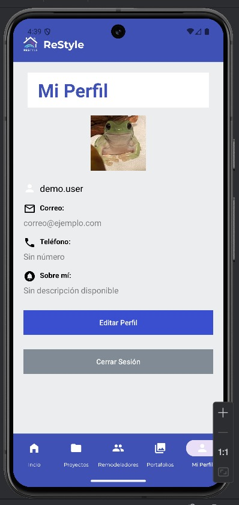

###### Implemented RESTful API and/or Serverless Backend Evidence

#### 7.2.1.6. Services Documentation Evidence for Sprint Review

Documentación de la API en Swagger/OpenAPI:
- Swagger UI: https://restyle-platform-bed4c3b3f3eug0ak.canadacentral-01.azurewebsites.net/swagger-ui/index.html#/

Capturas de la documentación:

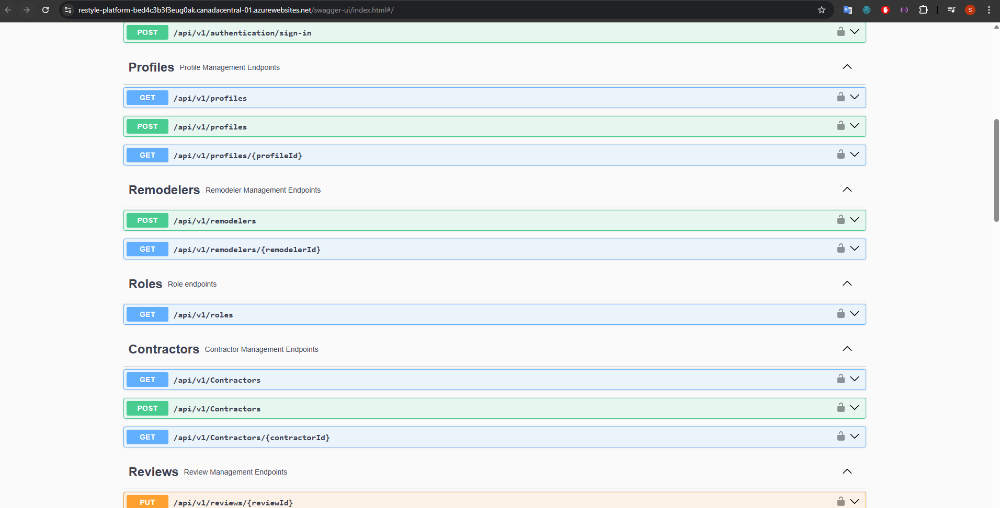
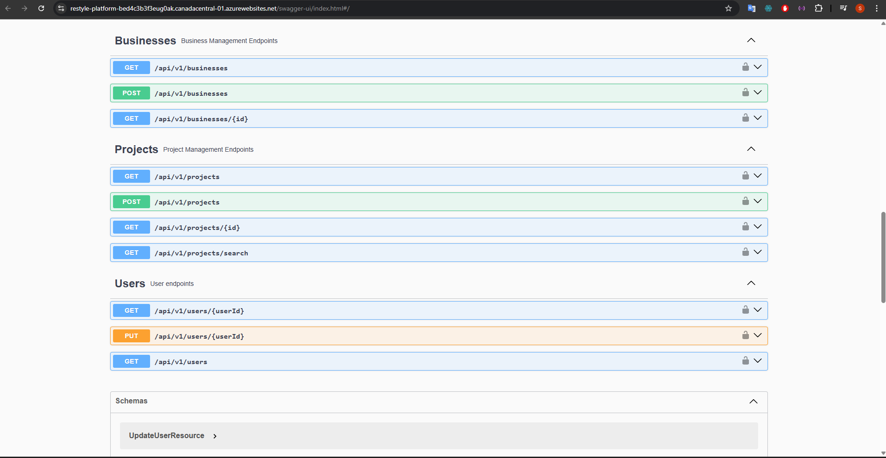
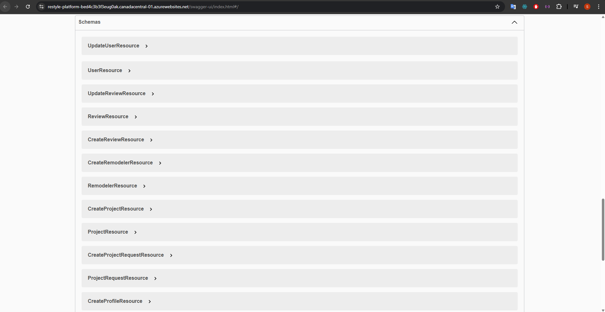

#### 7.2.2.7. Software Deployment Evidence for Sprint Review

Despliegues realizados y accesos. Actualizar fechas/horas según última publicación.

| Ambiente | Componente | URL | Deploy by | Fecha/Hora (GMT-5) | Evidencia |
|---|---|---|---|---|---|
| Production (GitHub Pages) | Landing Page | https://si0728-7281-grupo3.github.io/landingpage/#about-the-app | Equipo | YYYY-MM-DD HH:mm | Ver 7.2.1.5 (landing1–7.png) |
| Production (Netlify) | Frontend Web | https://restyle-frontend.netlify.app/ | Equipo | YYYY-MM-DD HH:mm | Ver 7.2.1.5 (frontend.png–3.png) |
| Production (Azure App Service) | Backend API (Swagger) | https://restyle-platform-bed4c3b3f3eug0ak.canadacentral-01.azurewebsites.net/swagger-ui/index.html#/ | Equipo | YYYY-MM-DD HH:mm | Ver 7.2.1.5 (web-service1–4.png) |
| Release (GitHub Releases) | Mobile APK | https://github.com/SI732-ExpDesign-Team/mobile/releases/download/v0.2.0-alpha/ReStyle.apk | Equipo | YYYY-MM-DD HH:mm | Ver 7.2.1.5 (release-mobile2.png) |

#### 7.2.2.8. Team Collaboration Insights during Sprint

En esta entrega, nuestra meta principal fue la implementación y despliegue de las soluciones de software. Para llevar a cabo este objetivo, hicimos uso de diversas herramientas como GitHub, Visual Studio Code, WebStorm y otros. A continuación, vamos a presentar los diagramas de flujo que representan los commits realizados por cada miembro del equipo:

Repositorio de project-report:
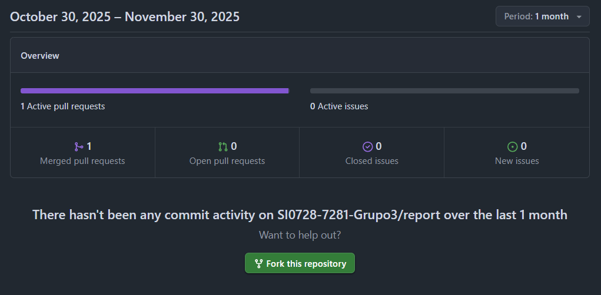 
Repositorio de landing page:
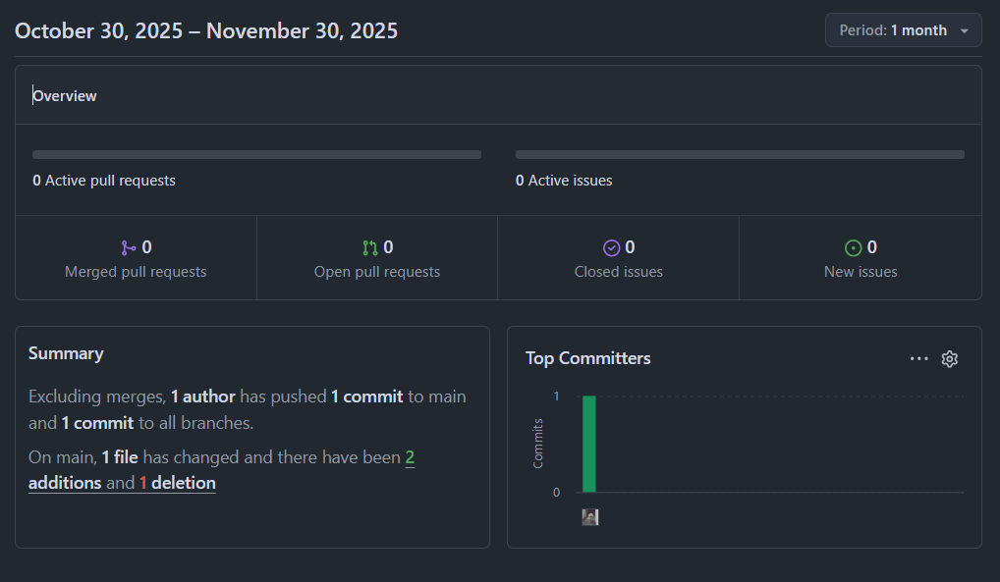 
Repositorio de frontend:
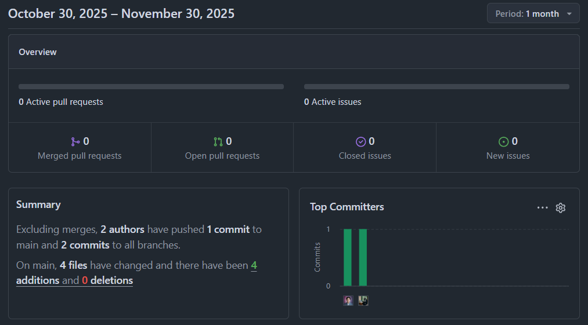 
Repositorio de web services:
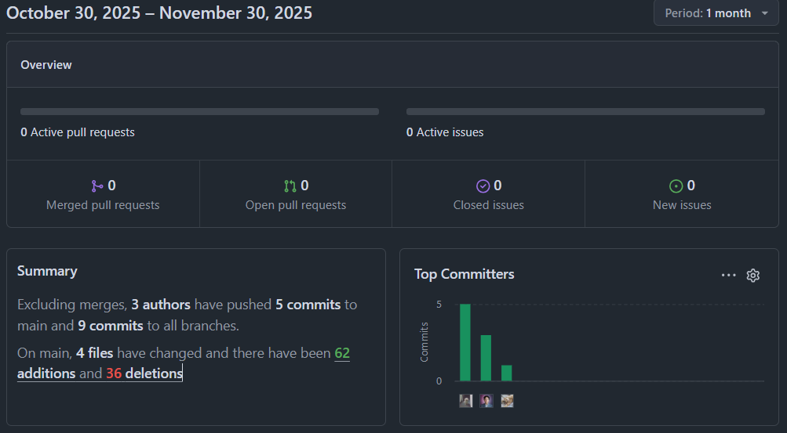 
Repositorio de mobile:
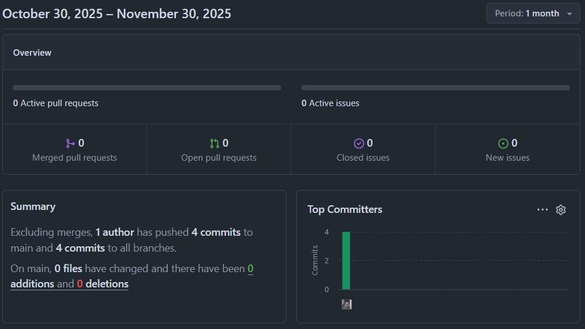 

Github: https://github.com/orgs/SI0728-7281-Grupo3/actions/metrics/usage

## 7.3. Validation Interviews
#### 7.3.1. Diseño de Entrevistas

#### **Segmento Objetivo 1: Contratistas en búsqueda de servicios de remodelación**

**Propósito de la entrevista:**  
Recolectar la opinión directa de contratistas o propietarios que desean contratar servicios de remodelación a través de la plataforma. Se busca conocer sus expectativas, problemas actuales en la búsqueda y contratación de remodeladores, así como validar si la solución de Restyle facilita una experiencia más eficiente, confiable y personalizada.

**Preguntas demográficas:**
1. ¿Cuál es su nombre completo?
2. ¿Cuál es su edad?
3. ¿En qué distrito reside?
4. ¿Cuál es su ocupación actual?
5. ¿Con qué frecuencia requiere servicios de remodelación?

**Interacción con la aplicación web:**  
Se invitará al entrevistado a utilizar la funcionalidad de búsqueda personalizada por ubicación y tipo de servicio, explorar perfiles de remodeladores, leer reseñas y simular una programación de consulta. Se observará su navegación y reacciones frente a cada función.

**Preguntas sobre la experiencia con la web:**
- ¿Le resultó intuitivo buscar remodeladores según su necesidad?
- ¿Considera útil poder filtrar por especialidades o ubicación?
- ¿Le parecieron útiles las opiniones y calificaciones de otros usuarios?
- ¿Programaría una consulta desde la plataforma en una situación real?
- ¿Qué elementos o funcionalidades cree que mejorarían la experiencia?

---

### **Segmento Objetivo 2: Remodeladores registrados en la plataforma**

**Propósito de la entrevista:**  
Comprender la experiencia del remodelador al utilizar la plataforma Restyle para ofrecer sus servicios. Se evaluará la facilidad para crear un perfil profesional, recibir solicitudes de consulta, gestionar opiniones de clientes y la percepción general del sistema como canal de captación de clientes.

**Preguntas demográficas:**
1. ¿Cuál es su nombre completo?
2. ¿Qué tipo de servicios de remodelación ofrece?
3. ¿En qué distritos trabaja actualmente?
4. ¿Cuántos años de experiencia tiene en el rubro?
5. ¿Trabaja de forma independiente o con una empresa?

**Interacción con la aplicación web:**  
Se invitará al remodelador a crear un perfil de servicio, revisar cómo se muestran sus datos al público, visualizar críticas de usuarios y probar la función de gestión de consultas programadas.

**Preguntas sobre la experiencia con la web:**
- ¿Fue sencillo crear y personalizar su perfil como remodelador?
- ¿Considera adecuada la forma en que los clientes pueden contactarlo?
- ¿Cree que las reseñas y valoraciones afectan positivamente su visibilidad?
- ¿Recibir solicitudes desde la plataforma le resulta útil para captar clientes?
- ¿Qué mejoras o funcionalidades adicionales le gustaría ver como profesional?

#### 7.3.2. Registro de Entrevistas

**Entrevistas a remodeladores:** 

|**Entrevistado 1** |**Pablo Mendez** |
| :-: | :-: |
|Edad | 25 |
|Distrito | Lima |
|Observaciones | Pablo valora la rapidez en la comunicación con contratistas. Solicita un chat integrado con notificaciones en tiempo real, respuestas rápidas y plantillas para cotizaciones. Pide además una sección para mostrar su cartera de clientes y proyectos completados (fotos, descripciones y referencias). |
|Timing: | [URL](https://upcedupe-my.sharepoint.com/:f:/g/personal/u202214695_upc_edu_pe/IgCWom5vYPeeRYu7F6JBNSixAR_HciTHAc5wRXEij7njYlg?e=Nqugqy) |
|**Entrevistado 2** |**Claudia Zapata** |
|Edad | 26 |
|Distrito | Lima |
|Observaciones | Claudia quiere un portafolio público organizado por tipo de proyecto y con métricas (valoraciones, número de trabajos). También solicita filtros para priorizar solicitudes urgentes y acceso fácil al historial de clientes y comunicaciones. |
|Timing: | [URL](https://upcedupe-my.sharepoint.com/:f:/g/personal/u202214695_upc_edu_pe/IgCWom5vYPeeRYu7F6JBNSixAR_HciTHAc5wRXEij7njYlg?e=Nqugqy) |
|**Entrevistado 3** |**Diego Bastidas** |
|Edad | |
|Distrito | |
| | |
|Timing: | [URL](https://upcedupe-my.sharepoint.com/:f:/g/personal/u202214695_upc_edu_pe/IgCWom5vYPeeRYu7F6JBNSixAR_HciTHAc5wRXEij7njYlg?e=Nqugqy) |

**Entrevistas a contratistas:** 

|**Entrevistado 1** |**Jose Albre** |
| :-: | :-: |
|Edad | 26 |
|Distrito | Independencia |
|Observaciones | Jose desea acelerar la interacción con remodeladores: chat instantáneo, ver disponibilidad en tiempo real y comparar portafolios rápidamente. Propone llamadas o video desde la plataforma y plantillas para solicitar cotizaciones. |
|Cita destacada | "Si puedo ver quién está disponible y hablar en minutos, el proceso es mucho más eficiente." |
|Timing: | [URL](https://upcedupe-my.sharepoint.com/:f:/g/personal/u202214695_upc_edu_pe/IgCWom5vYPeeRYu7F6JBNSixAR_HciTHAc5wRXEij7njYlg?e=Nqugqy) |
|**Entrevistado 2** |**Dylan Gonzales** |
|Edad | 25 |
|Distrito | San Juan de Miraflores |
|Observaciones | Dylan solicita filtros por disponibilidad, tiempo estimado y calificaciones para reducir el tiempo de selección. Valora notificaciones push cuando un remodelador responde y respuestas rápidas prediseñadas. |
|Cita destacada | "Quiero decidir rápido: disponibilidad, precio y reseñas son lo primero." |
|Timing: | [URL](https://upcedupe-my.sharepoint.com/:f:/g/personal/u202214695_upc_edu_pe/IgCWom5vYPeeRYu7F6JBNSixAR_HciTHAc5wRXEij7njYlg?e=Nqugqy) |
|**Entrevistado 3** |**Fabian Reyes** |
|Edad | |
|Distrito | |
| | |
|Timing: | [URL](https://upcedupe-my.sharepoint.com/:f:/g/personal/u202214695_upc_edu_pe/IgCWom5vYPeeRYu7F6JBNSixAR_HciTHAc5wRXEij7njYlg?e=Nqugqy) |

#### 7.3.3. Evaluaciones según heurísticas

**Usability** - **Inclusive Design** - **Information Architecture**

| CARRERA | Ingeniería de Software |
| ----- | ----- |
| **CURSO** | 1ASI0728 |
| **SECCIÓN** | 7281 |
| **PROFESORES** | Berrocal Navarro, Richard Leonardo |
| **CLIENTE(S)** | - |

##### SITE o APP A EVALUAR:

Prototipo de App Web y prototipo mobil

### TAREAS A EVALUAR:

El alcance de esta evaluación incluye la revisión de la usabilidad de las siguientes tareas:
1. Visualización y navegación del Landing Page.
2. Exploración de funcionalidades en el prototipo de la app.
3. Registro real de usuario.
4. Flujo del tipo de usuario designado.

ESCALA DE SEVERIDAD:

| Nivel | Descripción |
| ----- | ----- |
| 1 | Problema superficial: ocurre con muy poca frecuencia y no interfiere significativamente con la tarea. |
| 2 | Problema menor: ocurre ocasionalmente y dificulta un poco la tarea; prioridad baja de corrección. |
| 3 | Problema mayor: ocurre frecuentemente o impide avanzar sin ayuda; prioridad alta de corrección. |
| 4 | Problema muy grave: bloquea por completo la tarea; debe corregirse antes del lanzamiento. |

---

#### TABLA RESUMEN:

| Problema # | Heurística violada | Severidad | Resumen |
|---:|---|---:|---|
| 1 | Visibilidad del estado del sistema | 3 | Ausencia de indicador claro de disponibilidad de remodeladores (online/ocupado/última conexión). |
| 2 | Coincidencia sistema-mundo / Información reconocible | 3 | Portafolios de remodeladores no están estructurados ni muestran métricas relevantes. |
| 3 | Flexibilidad y eficiencia de uso / Reducción de carga cognitiva | 2 | Comunicación lenta: falta de respuestas rápidas, plantillas y notificaciones push. |
| 4 | Control y libertad de usuario / Búsqueda y filtrado | 2 | Filtros insuficientes por disponibilidad, tiempo estimado y calificaciones. |
| 5 | Diseño inclusivo / Accesibilidad básica | 2 | Contenido multimedia sin alternativas accesibles (descripciones/alt text) y contraste variable. |

---

#### DESCRIPCIÓN DE PROBLEMAS:

##### PROBLEMA #1:
* **Severidad:** 3  
* **Heurística violada:** Visibilidad del estado del sistema  
* **Descripción:** Los contratistas no pueden verificar rápidamente si un remodelador está disponible; la interfaz no muestra estado en tiempo real ni último acceso, lo que retrasa la interacción y obliga a múltiples intentos de contacto.  
* **Recomendación:** Implementar indicadores de presencia (online/ocupado/última conexión), mostrar tiempo estimado de respuesta y actualizar estados en tiempo real (WebSocket/SignalR). Añadir un CTA claro para contacto inmediato (chat/llamada).

##### PROBLEMA #2:
* **Severidad:** 3  
* **Heurística violada:** Coincidencia entre el sistema y el mundo real / Información reconocible  
* **Descripción:** Los remodeladores no disponen de una sección de portafolio estandarizada con evidencias (fotos, descripciones, métricas), lo que dificulta la evaluación comparativa por parte de contratistas.  
* **Recomendación:** Diseñar una sección de portafolio estructurada: galería con miniaturas, etiquetas por tipo de trabajo, número de proyectos, calificaciones y casos destacados. Permitir compartir enlaces directos al portafolio.

##### PROBLEMA #3:
* **Severidad:** 2  
* **Heurística violada:** Flexibilidad y eficiencia de uso / Reconocimiento en lugar de recuerdo  
* **Descripción:** La comunicación requiere escribir respuestas completas repetidamente; no hay plantillas ni respuestas rápidas, y las notificaciones pueden tardar en llegar.  
* **Recomendación:** Añadir respuestas rápidas/plantillas, atajos para mensajes frecuentes, notificaciones push y confirmaciones visuales de entrega/lectura.

##### PROBLEMA #4:
* **Severidad:** 2  
* **Heurística violada:** Control y libertad / Búsqueda y filtrado  
* **Descripción:** Falta de filtros que permitan ordenar y reducir candidatos por disponibilidad, tiempo estimado de ejecución y calificaciones, alargando el proceso de selección.  
* **Recomendación:** Implementar filtros avanzados y presets (disponible ahora, mejor valorado, tiempo estimado), y opción de comparar portafolios lado a lado.

##### PROBLEMA #5:
* **Severidad:** 2  
* **Heurística violada:** Diseño inclusivo / Accesibilidad  
* **Descripción:** Imágenes y multimedia del portafolio carecen de descripciones alternativas; contraste y tamaño de texto varían según pantalla, afectando a usuarios con necesidades de accesibilidad.  
* **Recomendación:** Añadir alt text en imágenes, garantizar contraste mínimo WCAG AA, permitir aumento de texto y navegación por teclado; incluir descripciones breves de proyectos.

---

Recomendaciones generales (priorizadas):
1. Señalización de disponibilidad en tiempo real y CTA de contacto rápido.  
2. Sección de portafolio estandarizada con métricas y filtros.  
3. Plantillas de respuesta, notificaciones push y confirmaciones de lectura.  
4. Filtros avanzados y funcionalidad de comparación.  
5. Mejoras de accesibilidad (alt text, contraste, tamaño de fuente).

## 7.4. Video About-the-Product
<b>ReStyle</b>
¿Tienes ganas de remodelar o reparar algún espacio de tu hogar?
ReStyle es la mejor aplicación para encontrar al profesional ideal en proyectos de remodelación y reparación de interiores del hogar. Conectamos tus ideas con expertos altamente calificados para transformar tu hogar en el espacio que siempre has deseado, tu proyecto ideal podría estar a un click de distancia.

¿Eres un experto en la remodelación o reparación de espacios del hogar?
ReStyle es el mejor amigo de los profesionales en remodelación y reparación de espacios del hogar, únete a nosotros para compartir tus mejores proyectos y servicios, potencia al máximo el alcance de tu empresa.

<b>Video About-the-Product:</b>
 

## 7.5. Conclusiones

- La integración de la inteligencia artificial mejoró la precisión y rapidez en la búsqueda y recomendación de profesionales, resolviendo de forma directa la necesidad principal de los usuarios. Esto generó un impacto positivo en el negocio y permitió cumplir los objetivos planteados.

- El uso de IA permitió procesar información y preferencias de manera más eficiente, facilitando la toma de decisiones del usuario y elevando la calidad del servicio. Gracias a ello, la plataforma pudo abordar la problemática inicial con mayor efectividad.

- La tecnología emergente permitió automatizar flujos clave del negocio, reduciendo fricciones en solicitudes, seguimientos y validaciones. Esta mejora operativa impactó directamente en la experiencia del usuario y contribuyó al logro de los objetivos funcionales del proyecto.

- La IA potenció el diseño UX y la arquitectura en bounded contexts, haciendo que la plataforma sea más escalable, accesible y alineada con las tendencias actuales. Esto permitió resolver la situación problemática desde un enfoque integral y sostenible.

- La combinación de inteligencia artificial, arquitectura modular y una estrategia de diseño centrada en el usuario permitió desarrollar una solución que atiende de manera efectiva las necesidades del mercado. Gracias a ello, el proyecto alcanzó sus objetivos y demostró el valor real de aplicar tecnologías emergentes en ingeniería.

## 7.6. Bibliografía

- INEI. https://www.inei.gob.pe  
- Ipsos Perú. https://www.ipsos.com  
- Microsoft News Center LATAM. https://news.microsoft.com/latam  
- Apple Human Interface Guidelines. https://developer.apple.com/design/human-interface-guidelines/  
- Material Design. https://material.io  
- PostgreSQL Documentation. https://www.postgresql.org/docs/  
- Nielsen Norman Group. https://www.nngroup.com

## 7.7. Anexos

Enlaces y artefactos relevantes del proyecto:

---

### Despliegues / Aplicaciones

- **Landing Page (Producción – GitHub Pages):**  
  https://si0728-7281-grupo3.github.io/landingpage/#about-the-app  
  *Evidencia:* Ver 7.2.1.5 (landing1–7.png)

- **Frontend Web (Producción – Netlify):**  
  https://restyle-frontend.netlify.app/  
  *Evidencia:* Ver 7.2.1.5 (frontend.png–3.png)

- **Backend API – Swagger (Producción – Azure App Service):**  
  https://restyle-platform-bed4c3b3f3eug0ak.canadacentral-01.azurewebsites.net/swagger-ui/index.html#/  
  *Evidencia:* Ver 7.2.1.5 (web-service1–4.png)

- **Mobile APK (Release – GitHub Releases):**  
  https://github.com/SI732-ExpDesign-Team/mobile/releases/download/v0.2.0-alpha/ReStyle.apk  
  *Evidencia:* Ver 7.2.1.5 (release-mobile2.png)

---

### Repositorios del Proyecto

- **Landing Page (repo):**  
  https://github.com/SI0728-7281-Grupo3/landingpage

- **Frontend (repo):**  
  https://github.com/SI0728-7281-Grupo3/frontend-main

- **Backend (repo):**  
  https://github.com/SI0728-7281-Grupo3/backend-main

- **Mobile (repo):**  
  https://github.com/SI0728-7281-Grupo3/mobile-main

